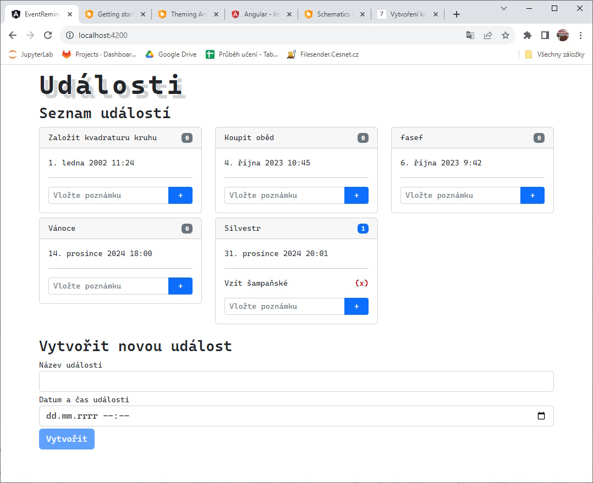

# Vytvoření komponent

Dalším krokem je vytvoření komponent, které budou zobrazovat data.

<figure><figcaption></figcaption></figure>

## Tvorba komponent

V projektu použijeme 3 komponenty:

* **event-list** jako hlavní komponentu, která bude zobrazovat seznam událostí, a interně bude v sobě zobrazovat další komponenty,
* **event-create** jako komponentu pro pro vytváření nové události; bude zobrazena uvnitř hlavní komponenty,
* **event-note** jako komponentu zobrazující poznámky u události a jejich přidávání a mazání; bude zobrazena uvnitř hlavní komponenty.

Protože se hned na komponenty budeme odkazovat, vytvoříme je všechny najednou, do složky /src/app/components:

```powershell
ng g c event-create
ng g c event-list
ng g c event-note
```

## Routing

Dále přizpůsobíme routing. V naší aplikaci budeme mít pouze jednu hlavní zobrazovací komponentu. Proto uděláme jednu univerzální cestu. Do souboru `app-routing.module.ts` přidáme cestu (upravíme proměnnou `routes`):

```typescript
const routes: Routes = [
  { path : "", component : EventListComponent}
];
```

## Pipe

Pro formátování datumu v TypeScriptu lze využít funkci `format` (například viz [https://medium.com/@glasshost/how-to-format-date-time-in-typescript-97ca7580afb1](https://medium.com/@glasshost/how-to-format-date-time-in-typescript-97ca7580afb1)), ale její použití je v základu omezené na anglické nastavení. Pro podporu dalších jazyků se do projektu musí zavést internacionalizace, což je pro projekt naše rozsahu zbytečné.

Proto si vytvoříme vlastní funkci, která bude generovat zobrazování datumu v českém formátu. Do projektu do složky /src/app/pipes přidáme jednoduchý soubor `czech-date.pipe.ts` s následujícím kódem:


```typescript
import {Pipe, PipeTransform} from "@angular/core";
import {formatDate} from "@angular/common";

@Pipe({name: 'czechDatePipe'})
export class CzechDatePipe implements PipeTransform {
  transform(value: Date): string {
    return formatDate(value, "d. MMMM yyyy H:mm", "en-US")
      .replace(      "January", "ledna")
      .replace(      "February", "února")
      .replace(      "March", "března")
      .replace(      "April", "dubna")
      .replace(      "May", "května")
      .replace(      "June", "června")
      .replace(      "July", "července")
      .replace(      "August", "srpna")
      .replace(      "September", "září")
      .replace(      "October", "října")
      .replace(      "November", "listopadu")
      .replace(      "December", "prosince");
  }
}

```


Třída obsahuje funkci `transform(...)`. Ve funkci provedeme základní převedení datumu na anglický a posléze jen nahradíme text měsíce českým ekvivalentem.

Povšimněte si řádku 4, který definuje, že funkce se bude chovat jako "pipe" - její použití uvidíme v komponentě.

## Tvorba komponenty event-list

### Kód na pozadí - ts

Kód na pozadí komponenty je poměrně jednoduchý.


```typescript
import {Component} from '@angular/core';
import {EventDto} from "../../model/event-dto";
import {EventService} from "../../services/event.service";
import {EventHttpError} from "../../services/event-http.service";

@Component({
  selector: 'app-event-list',
  templateUrl: './event-list.component.html',
  styleUrls: ['./event-list.component.css']
})
export class EventListComponent {

  events: EventDto[] = [];

  constructor(
    private eventService: EventService
  ) {
  }

  ngOnInit() {
    this.eventService.getAll()
      .subscribe({
        next: q => this.events.push(q),
        error: (e: EventHttpError) => console.log(e.message)
      })
  }

  protected onEventCreated(event: EventDto): void {
    this.events.push(event);
  }
}

```


V konstruktoru (řádek 16) připojíme do komponenty službu událostí `eventService`. Na řádku 13 definujeme `events` jako seznam událostí, které se budou zobrazovat. Tato proměnná se ihned incializuje jako prázdné pole `[]`, do kterého se při inicializaci komponenty (`ngOnInit()`, řádek 20) přes `eventService.getAll()` načtou všechny události a postupně se plní do seznamu událostí (řádek 23).

Jako parametru funkce `subscribe(...)` (řádek 23-24) je struktura se dvěma prvky:

* `next` říká, co se má dít s nově příchozím prvkem;
* `error` říká, co se má stát v případě chyby.

Na konci kódu je bonusová funkce `onEventCreated(...)`, která se volá, když vnitřní komponenta vytvoří novou událost. Nově vytvořená událost se pošle do této funkce jako parametr a funkce nový objekt přidá do seznamu objektů.

### Kód popředí - html

Kód na popředí vložíme do souboru `event-list.component.html`:


```html
<h3>Seznam událostí</h3>

<div *ngIf="events.length == 0">
  ... zatím žádné události
</div>

<div *ngIf="events.length != 0">
  <div class="row">
    <div *ngFor="let event of events" class="col-sm-12 col-md-6 col-lg-4  mb-2">
      <div class="card">
        <div class="card-header d-flex">
          <div>
            {{event.title}}
          </div>
          <div class="ms-auto">
            <div class="badge ml-5"
            [class.bg-primary]="event.notes && event.notes.length > 0"
            [class.bg-secondary]="!event.notes || event.notes.length == 0">
              {{event.notes.length}}
            </div>
          </div>
        </div>
        <div class="card-body">
          {{event.dateTime | czechDatePipe}}
          <hr />
          <app-event-note [event]="event"></app-event-note>
        </div>
      </div>
    </div>
  </div>
</div>

<div>
  <h3 class="mt-3">
    Vytvořit novou událost
  </h3>
  <app-event-create (onCreated)="onEventCreated($event)"></app-event-create>
</div>
```


Blok řádků 3-5 se zobrazí pouze v případě, kdy je kolekce událostí prázdná.

Naopak, blok řádků 7-31 se zobrazuje, pokud je kolekce událostí neprázdná. V tom případě se každá položka (iterace řádek 9) kreslí do tzv. "karty" BootStrapu ([https://getbootstrap.com/docs/5.0/components/card/](https://getbootstrap.com/docs/5.0/components/card/)). Záhlaví karty obsahuje název události (řádek 13) a badge ([https://getbootstrap.com/docs/5.0/components/badge/](https://getbootstrap.com/docs/5.0/components/badge/)) s počtem poznámek (řádky 16-20, povšimněte si podmíněného přiřazení stylů podle počtu poznámek u události). V samotném těle karty se zobrazí datum události formátovaný námi dříve vytvořenou pipe `CzechDatePipe` (řádek 24) a vloženou komponentou pro poznámky (řádek 26). Konečně, na konci stránky se zobrazuje formulář pro přidání nových událostí s vloženou komponentou (řádek 37).

## Tvorba komponenty event-create

### Kód na pozadí - ts

Kód na pozadí sestaví zejména podkladové prvky pro angular-reaktivní formulář ([https://angular.io/guide/reactive-forms](https://angular.io/guide/reactive-forms)) a obsluhující metodu:


```typescript
import {Component, EventEmitter, Output} from '@angular/core';
import {EventService} from "../../services/event.service";
import {FormBuilder, Validators} from "@angular/forms";
import {EventDto} from "../../model/event-dto";

@Component({
  selector: 'app-event-create',
  templateUrl: './event-create.component.html',
  styleUrls: ['./event-create.component.css']
})
export class EventCreateComponent {

  protected form = this.fb.group({
    text: ['', Validators.required],
    dateTime: ['', Validators.required]
  });
  @Output() onCreated = new EventEmitter<EventDto>();

  constructor(
    private eventService: EventService,
    private fb: FormBuilder) {
  }

  protected submitNewEvent() {
    const text = this.form.get("text")?.value!;
    const dateTimeS = this.form.get("dateTime")?.value!;
    const dateTime = new Date(dateTimeS);

    this.eventService.create(text, dateTime)
      .subscribe(q => this.onCreated.emit(q));
  }
}

```


Řádky 13-16 vytvářejí podkladové objekty, na které se budou připojovat input-prvky z HTML komponenty. Řádek 17 je důležitý - definuje výstupní událost, pomocí které bude komponenta dávat vědět svému okolí navenek, že došlo k vytvoření nového objektu události. Zároveň bude tento objekt posílat jako parametr - `EventEmitter<EventDto>`.


Problematika komunikace mezi komponenty je zajímavá - viz například [https://angular.io/guide/component-interaction](https://angular.io/guide/component-interaction) nebo [https://upmostly.com/angular/inter-component-communication-in-angular-joining-service](https://upmostly.com/angular/inter-component-communication-in-angular-joining-service).


Řádky 20-21 jen zajistí vytvoření požadovaných objektů v konstruktoru. Funkce na řádku 24 se volá při potvrzení HTML formuláře a žádosti o vytvoření nového objektu. Z formuláře nejdříve získáme zadaná data (řádky 25-27) a následně přes službu zažádáme o jejich uložení (řádek 29) a po úspěšeném uložení vyvoláme navázanou událost (řádek 30).

### Kód na popředí - html

Kód na popředí obsahuje pouze formulář.


```html
<form [formGroup]="form" (ngSubmit)="submitNewEvent()">
  <div class="form-group mt-1">
    <label for="title">Název události</label>
    <input type="text" name="title" id="title" class="form-control" formControlName="text" />
  </div>
  <div class="form-group mt-1">
    <label for="dateTime">Datum a čas události</label>
    <input type="datetime-local" name="dateTime" id="dateTime" class="form-control" formControlName="dateTime" />
  </div>
  <div class="form-group mt-1">
    <button type="submit" class="btn btn-primary" [disabled]="!form.valid">Vytvořit</button>
  </div>
</form>

```


Na formuláři nedříve připojíme objekty z pozadí a potvrzovací událost (řádek 1, `[formGroup]` a `(ngSubmit)`). Následně vytvoříme vstupní prvky a připojíme je k objektům pozadí (řádky 4, 8, atribut `formControlName`).

Finálně vytvoříme odesílací tlačítko. Tlačítko zašedneme (disabled), pokud formulář neobsahuje validní data (`[disabled]=...`).

## Tvorba komponenty event-note

Poslední komponentou je ta, která se stará jednak o zobrazení listu komentářu k události s možností jednotlivé položky smazat, a jednak mini-formuláře pro vložení nového komentáře

### Kód na pozadí - ts


```typescript
import {Component, Input} from '@angular/core';
import {EventDto} from "../../model/event-dto";
import {FormBuilder} from "@angular/forms";
import {EventService} from "../../services/event.service";

@Component({
  selector: 'app-event-note',
  templateUrl: './event-note.component.html',
  styleUrls: ['./event-note.component.css']
})
export class EventNoteComponent {
  @Input() event: EventDto | undefined;

  protected noteForm = this.fb.group({
    text: ['']
  });

  constructor(
    private fb: FormBuilder,
    private eventService: EventService
  ) {
  }

  onNoteSubmit() {
    const text = this.noteForm.get("text")?.value!;
    this.eventService.createNote(this.event?.eventId!, text).subscribe(
      q => this.event?.notes.push(q));
  }

  protected deleteNote(noteId: number) {
    if (confirm("Opravdu smazat poznámku?"))
      this.eventService.deleteNote(noteId).subscribe(
        () => {
          const noteIndex = this.event?.notes.findIndex(q => q.noteId == noteId);
          if (noteIndex != undefined)
            this.event?.notes.splice(noteIndex, 1);
        });
  }
}
```


Na řádku 12 se vytvoří vstupní parametr `@Input` pro předání aktuálně zobrazované události. Na řádcích 14-16 se vytvoří formulář pro přidání nové položky. Na řádcích 19 a 20 se v konstruktoru připraví objekty používané v komponentě.

Na řádku 24 se definuje funkce volaná při potvrzení vložení nového komentáře k události. Nejdříve se zjistí data z formuláře (řádek 25) a následně se přes službu předají k uložení (řádek 26). Po úspěšném uložení se nově vytvořený komentář přidá k současným komentářům aktuální události (řádek 27).

Na řádku 30 je uvedena funkce volaná při mazání poznámek. Jako svůj parametr přijímá `noteId` poznámky, která se má smazat. Nejdříve se provede potvrzovací dotaz na smazání položky (pro jednoduchost realizován s pomocí výchozí implementace prohlížeče - řádek 31), při potvrzení se následně požádá služba o smazání poznámky (řádek 32) a nakonec se ze seznamu aktuálních komentářů vybrané události smaže ten (ty), které mají odpovídající ID (řádky 34-36).

### Kód na popředí - html


```typescript
<div>
  <div *ngFor="let note of event?.notes" class="d-flex">
    <div>{{note.text}}</div>
    <div class="ms-auto" style="cursor: pointer; color:#C00;font-weight: bold"
         (click)="deleteNote(note.noteId)"
         data-bs-toggle="tooltip" data-bs-placement="top" title="Smazat poznámku">
      (x)
    </div>
  </div>
</div>

<form [formGroup]="noteForm" (ngSubmit)="onNoteSubmit()" class="row rows-cols-auto mt-3">
  <div class="input-group input-group-sm">
    <input type="text" class="form-control col-8" id="noteText" formControlName="text"
           placeholder="Vložte poznámku"/>
    <button type="submit" class="btn btn-sm btn-primary col-2">+</button>
  </div>
</form>

```


V kódu HTML se na řádcích 2-9 definují bloky zobrazující jednotlivé komentáře; každý blok obsahuje text komentáře (řádek 3) a tlačítko (a-la element `div`) pro smazání daného komentáře (řádek 4-8, všimněte si předání parametru mazaného `noteId` na řádku 5).

Blok na řádku 12-18 definuje formulář pro přidání nové položky. Obsahuje jednoduchý input (řádek 14-15) a tlačítko (řádek 16).
