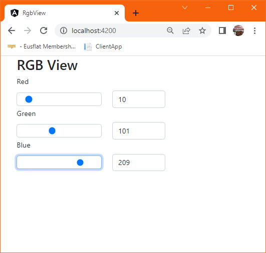

# Základní práce s komponentami - Projekt  'RGB View'


K vývoji můžeme používat libovolný smysluplný nástroj. Příkladem může být [Visual Studio Code](https://code.visualstudio.com/), nebo IntelliJ prostředí [IDEa](https://www.jetbrains.com/idea/). V tomto příspěvku bude použito vývojové prostředí [WebStorm](https://www.jetbrains.com/webstorm/). Prostředí se mohou lišit v míře podpory (a tím jednoduchosti tvorby), ale výsledná aplikace bude totožná bez ohlednu na použité prostředí.


## Vytvoření nového projektu

Projekt můžeme vytvořit s pomocí příkazové řádky, nebo s pomocí prostředí WebStorm.

### Vytvoření přes příkazovou řádku

Otevřeme příkazovou řádku. Projekt se vytváří příkazem `ng new <název-projektu>`. Pro náš projekt tedy zadáme:

```powershell
ng new rgb-view
```

Aplikace se následně dotáže, zda chceme integrovat Angular routing.

```
? Would you like to add Angular routing? (y/N)
```

Routing umožňuje jednoduchý překlad URL adres na komponenty které je budou obsluhovat. V našem projektu toto nyní nebudeme potřebovat.

Další dotaz bude na použitý formát kaskádových stylů:

```
> CSS
  SCSS   [ http://sass-lang.com/documentation/file.SASS_REFERENCE.html#syntax ]
  Sass   [ http://sass-lang.com/documentation/file.INDENTED_SYNTAX.html       ]
  Less   [ http://lesscss.org                                                 ]
  Stylus [ http://stylus-lang.com                                             ]
```

Pokud jste seznámeni, můžete zvolit jakýkoliv, v naší aplikaci se podržíme klasického CSS. Vybíráme šipkou, potvrdíme enter.

Následně prostředí stáhne požadované balíčky a vytvoří projekt do složky.

### Vytvoření přes prostředí WebStorm

V prostředí WebStorm zvolíme volbu "New Project".&#x20;

V levém sloupci průvodce vybereme položku "Angular CLI" (pozor, přepnutí může trvat pár sekund) a do pravé části okna zadáme název projektu. Následně výběr potvrdíme tlačítkem "Create".&#x20;

Prostředí stáhne požadované balíčky a vytvoří projekt do složky.

## Spuštění projektu

### Spuštění přes příkazovou řádku

Otevřeme si terminálové okno **ve složce projektu**. Následně lze jednoduše projekt spustit příkazem:

```
ng serve
```

Tento příkaz projekt sestaví a následně spustí server naslouchající (ve výchozím nastavení) na portu 4200. Pokud za příkaz doplníme volbu `ng serve --open`, otevře se zároveň okno výchozího prohlížeče s aplikací.

### Spuštění přes prostředí WebStorm

Prostředí WebStorm při vytvoření projektu automaticky vytvoří spouštěcí konfiguraci pro prostředí Angular. Stačí tedy kliknout na zelenou šipku pro spuštění serveru, nebo zvolit menu "Run" -> "Run".

Po spuštění je následně třeba ručně spustit vybraný prohlížeč a otevřít URL adresu aplikace - typicky `http://localhost:4200`.


Někdy se při prvním spuštění aplikace může objevit dotaz, zda chcete sdílet pseudoanonymizovaná data Angular Týmem pro další vývoj. Na tento dotaz musíte odpovědět (y/n), jinak spouštění aplikace nebude pokračovat. Zvolená volba nemá funkční vliv na výslednou spuštěnou aplikaci.



Pro procházení aplikací můžete použít libovolný prohlížeč otevřený na adrese `http://localhost:4200`. V příkladech bude pro demonstraci použit prohlížeč Chrome. Zároveň doporučujeme otevřít nástrojovou lištu vývojáře - klávesa F12.



Aplikaci při vývoji nemusíme vypínat a prohlížeč nemusíme zavírat. Angular je vybaven systémem pro detekci změn a kdykoliv uložíme v projektu soubor, kompilátor projekt přeloží a znovu nasadí na server. V prohlížeči se automaticky obnoví stránka a  změněná aplikace se automaticky zobrazí.



## Představení struktury projektu

Vytvoření projekt hned od začátku obsahuje několik různých složek se soubory. Představíme ty nejdůležitější (cesty jsou uvedeny úplné od nejvyšší složky projektu):

* `/src/index.html` - základní HTML stránka projektu. Do této stránky se následně vkládá všechen zobrazovaný obsah (tedy komponenty). Programátor zde může doplnit svůj vlastní obsah, požadované externí styly, CDN zdroje atp.
* `/src/styles.css`- základní CSS styly platné pro celou aplikaci
* `/src/app/app.module.ts` - základní soubor definující modul aplikace. Tento soubor definuje, jaké jsou v projektu používány komponenty, jaké připojuje ostatní moduly a další věci.
* `/src/app/app.component.*` - soubory css/html/spec.ts/ts definují komponentu. Význam jednotlivých souborů bude vysvětlen později.

## Přidání podpory BootStrap do projektu

BootStrap je framework umožňující využívat předdefinované HTML styly k tvorbě standardizovaných a vizuálně příjemných komponent. Technicky se jedná o skupinu CSS stylů a JavaScript skriptů, které definují vzhled různých boků a jejich dynamickou funkcionalitu.


Pro více info o BootStrap viz například [https://getbootstrap.com/](https://getbootstrap.com/).


Protože se jedná o CSS + JS, lze tyto části do projektu přidat dvěma způsoby:

* Stažením souborů do složky lokálního projektu a odkazování se na tyto soubory lokálně (typicky s využitím NPM).
* Využitím tzv. CDN (content delivery network) a přidat odkaz na soubory ve vzdáleném umístění.


Pro více info o CDN viz například [https://cs.wikipedia.org/wiki/Content\_delivery\_network](https://cs.wikipedia.org/wiki/Content\_delivery\_network).


V obou případech přidáváme odkaz na soubory pomocí `<link ...` / `<script ...` do hlavičky HTML v souboru `index.html`.

V našem případě využijeme CDN variantu. Nejdříve otevřeme adresu [https://getbootstrap.com/docs/5.2/getting-started/download/](https://getbootstrap.com/docs/5.2/getting-started/download/), nalezneme sekci "CDN via jsDelivr" a zkopírujeme odkazy s elementy `link/script`.

Následně otevřeme soubor `index.html` a odkazy vložíme do hlavičky HTML (řádky 9-15):


```html
<!doctype html>
<html lang="en">
<head>
  <meta charset="utf-8">
  <title>RgbView</title>
  <base href="/">
  <meta name="viewport" content="width=device-width, initial-scale=1">
  <link rel="icon" type="image/x-icon" href="favicon.ico">
  <!-- BootStrap CSS -->
  <link href="https://cdn.jsdelivr.net/npm/bootstrap@5.2.2/dist/css/bootstrap.min.css" rel="stylesheet"
        integrity="sha384-Zenh87qX5JnK2Jl0vWa8Ck2rdkQ2Bzep5IDxbcnCeuOxjzrPF/et3URy9Bv1WTRi" crossorigin="anonymous">
  <!-- BootStrap JavaScript Bundle with Popper -->
  <script src="https://cdn.jsdelivr.net/npm/bootstrap@5.2.2/dist/js/bootstrap.bundle.min.js"
          integrity="sha384-OERcA2EqjJCMA+/3y+gxIOqMEjwtxJY7qPCqsdltbNJuaOe923+mo//f6V8Qbsw3"
          crossorigin="anonymous"></script>
</head>
<body>
<div class="container">
  <h1>RGB View</h1>
  <app-root></app-root>
</div>
</body>
</html>
```



## Představení komponenty

Komponenta je základní mechanismus pro reprezentaci zobrazených dat v prostředí Angular. Komponenta se typicky sestává ze 3-4 souborů se stejným názvem lišícími se příponou:

* `.css` - obsahující  kaskádové styly použité v daném komponentě,
* `.html` - soubor obsahující HTML kód (rozšířené o další Angular značky) popisující, jak se bude komponenta zobrazovat,
* `.ts` - soubor obsahující TypeScript kód komponenty.
* `.spec.ts` - soubor obsahující TypeScript kód komponenty pro testy.

### HTML soubor

HTML soubor obsahuje kód komponenty psaný v jazyce HTML. Oproti HTML stránce obsahuje pouze obsah komponenty `<body>`, neobsahuje tedy žádné elementy vztažené například k `<head>`. HTML v Angularu může obsahovat i specifické Angular html značky (např. `*ngIf*`, `[(ngModel)]`) či speciální elementy pro vkládání komponent.


```html
<div class="row">
  <div class="col-4">
    <input type="range" min="0" max="255" [(ngModel)]="value"/>
  </div>
  <div class="col-4">
    <span>{{value}}</span>
  </div>
</div>
```


### TS soubor

TS soubor obsahuje TypeScript kód popisující komponentu.&#x20;

_TypeScript_ (dále též TS) je nadstavba jazyka JavaScript (dále též JS), přidávájící zejména typovou kontrolu. Díky tomu se spousta případných chyb projeví již v době psaní kódu a ne až při spuštění. Kód TypeScript se následně překládá do JS, který se vykonává.&#x20;


Pro bližší info viz například [https://www.typescriptlang.org/](https://www.typescriptlang.org/).


V TypeScript se definuje chování komponenty, její komunikace s okolím a také data, která se následně zobrazují v HTML.

```typescript
import {Component, EventEmitter, Input, OnInit, Output} from '@angular/core';

@Component({
  selector: 'app-value-selector',
  templateUrl: './value-selector.component.html',
  styleUrls: ['./value-selector.component.css']
})
export class ValueSelectorComponent implements OnInit {

  @Input() value : number = 10;
  @Output() valueChange = new EventEmitter<number>();

  constructor() {
  }

  ngOnInit(): void {
  }

}
```

Z pohledu jazyka je komponenta třída (zde `ValueSelectorComponent`, která má u sebe anotaci `@Component`. Tato anotace definuje:

* `selector`- tedy jak se z html budeme na danou komponentu odkazovat. Pokud chceme, aby někde v HTML se zobrazila tato komponenta, napíšeme tam `<app-value-selector></app-value-selector`.
* `templateUrl` - udává, kde se nachází soubor s HTML kódem komponenty. HTML kód komponenty může být také uveden přímo v .ts soubor, pokud je vynechán atribut `templateUrl`a nahrazen atributem `template`. Za něj/do něj se následně píše HTML kód. Tento způsob bývá běžný například v jednoduchých návodech na internetu.
* `styleUrls` - udává název/názvy souborů, které obsahují kaskádové styly pro danou komponentu.


Pro bližší info viz například [https://angular.io/guide/component-overview](https://angular.io/guide/component-overview).


## Demonstrace základního propojení (binding)

Základní výchozí komponenta aplikace je reprezentována soubory `/src/app/app.component.*`. Soubor `app.component.html` reprezentuje HTML obsah komponenty (tj. to, co se zobrazuje). S ohledem na různé verze Angularu a další nastavení se obsah tohoto souboru liší. My se po spuštění můžeme podívat na úvodní stránku vytvořené aplikace - to, co se zobrazuje v prohlížeči, je právě obsah tohoto souboru.&#x20;

My jako první krok obsah tohoto souboru zcela smažeme. Budeme jej vytvářet vlastní.

### Interpolace

Nejdříve zkusíme přinutit komponentu, ať v okně zobrazí hodnotu proměnné.&#x20;

_Interpolace_ je základní způsob, jak zobrazit hodnotu proměnné/metody z TS kódu v HTML komponentě. Zapisuje se do HTML kódu ve formátu `{{výraz}}`\`, kde výraz reprezentuje výraz k vyhodnocení, typciky odkaz na proměnnou/metodu definovanou v TS komponenty. Jedná se o jednosměrnou vazbu TS => HTML.

Demonstraci provedeme na hlavní komponentě `app.component`. Do souboru `app.component.ts`dopíšeme proměnnou:


```typescript
import { Component } from '@angular/core';

@Component({
  selector: 'app-root',
  templateUrl: './app.component.html',
  styleUrls: ['./app.component.css']
})
export class AppComponent {
  title = 'rgb-view';
  value = 10; // <-- toto
}
```


Do HTML kódu doplníme jednoduchý kód:


```html
<div>Hodnota je {{value}}.</div>
```


Při přepnutí do prohlížeče prohlížeč zobrazí stránku se zobrazenou hodnotou. V TS můžeme hodnotu jednoduše změnit na jinou a sledovat, jak se  změna promítne do výsledné zobrazené aplikace.


Pro bližší info viz například [https://angular.io/guide/interpolation](https://angular.io/guide/interpolation).


### Binding

_Binding_ - navazování/vazby - je technika sloužící k propagaci změn z jednoho zdroje do druhého. _Interpolace_ z předchozí sekce je z pohledu chování druhem bindingu, protože propaguje změnu hodnoty proměnné do HTML. Používá se však pro zobrazení statického textu získaných  z výrazů.

Pro propojení s vstupním prvky HTML (typu `<input...`) se používají vazby. Před jejich zprovozněním se vstupy je však třeba do projektu přidat podporu pro formuláře.

#### Přidání FormsModule

Do projektu přidáme další modul, který umožní šikovně používat binding ve spolupráci s HTML vstupy.

Otevřeme soubor `app.module.ts` a  do jeho sekce `imports` vložíme odkaz na modul `FormsModule` (řádek 14). Aby byl odkaz na `FormsModule`znám, musíme ještě na začátek souboru vložit import `import {FormsModule} from "@angular/forms";` (řádek 6). Upravený soubor tedy bude:


```typescript
import { NgModule } from '@angular/core';
import { BrowserModule } from '@angular/platform-browser';

import { AppComponent } from './app.component';
import { AppRoutingModule } from './app-routing.module';
import {FormsModule} from "@angular/forms";

@NgModule({
  declarations: [
    AppComponent
  ],
  imports: [
    BrowserModule,
    FormsModule
  ],
  providers: [],
  bootstrap: [AppComponent]
})
export class AppModule { }
```


FormsModule umožňuje pro HTML a formuláře používat direktivu `ngModel`, držet na pozadí model synchronizovaný s vstupními prvky HTML, informovat o změnách v těchto prvcích a propagovat tyto změny dále. S jeho využitím můžeme synchronizovat hodnoty mezi proměnnými komponenty a zobrazením.

#### Dopředný binding

Dopředný binding je velmi podobný interpolaci, ale používá se primárně u vstupních html prvků. Dopředný binding zapisujeme pomocí lomených závorek, tedy například `[...]`. Následuje přiřazení do výrazu, ze kterého se má získat hodnota. Tedy například `[ngModel] = "value"`.&#x20;

Do našeho HTML kódu přidáme vstupní prvky pro rozsah a zadávání číselného vstupu. Oba prvky navážeme přes `ngModel` na dříve vytvořenou proměnnou value.


```html
Hodnota je {{value}}.
<input type="range" [ngModel]="value"/>
<input type="number" [ngModel]="value"/>
```


V aplikaci nyní vidíme, že oba input prvky zobrazují korektně hodnotu načtenou z TS (viz kód výše). Změna hodnot v jednom prvku se však neprojeví zpátky ani v třídní proměnné `value`, ani v ostatních prvcích.

#### Zpětný binding

Zpětný binding se používá při notifikaci o změně provedené na formuláři. Pokud uživatel změní hodnotu v prvku v HTML, model automaticky tuto změnu propaguje do proměnné komponenty. Pokud jsou navíc na tuto proměnnou navázány dopředným bindingem další hodnoty, změna se propaguje dále. Zpětný binding se zapisuje pomocí kulatých závorek, tedy například `(...)`. Následuje typicky odkaz výraz, který má přiřazení zpracovat.

Upravíme vstup range tak, aby se jeho změna propagovala zpátky. Upravíme html kód na:


```html
Hodnota je {{value}}.
<input type="range" [ngModel]="value" (ngModelChange)="value = $event"/>
<input type="number" [ngModel]="value"/>
```


Vidíme, že u zpětné vazby je doplněný výraz, který říká, že do hodnoty proměnné `value`se má vložit hodnota měněné události.


Obrat `$event` je "klíčové slovo" odkazující na data události, v našem případě na měněnou hodnotu.


Pokud nyní kód spustíme, uvidíme, že se hodnota v prohlížeči zobrazuje korektně. Navíc se však při změně posuvníku tato změna propaguje i do proměné `value`v komponentě a také do ostatních jejích propojení.


Zpětný binding přes `(ngModelChange)`lze připojit pouze pokud je připojen také dopředný `[ngModel]` binding, protože jinak nemá Angular "model", na kterém by změny sledoval. Lze však také připojit zpětný binding na klasické DOM události (například `(change)`, ve kterých lze následně provést libovolné zpracování založené na DOM.


#### Obousměrný bidning

Aby programátor nemusel psát obě direktivy `[ngModel]` i `(ngModelChange)`, existuje speciální operátor, která dělá obousměrnou vazbu automaticky. Operace je založena na tzv "banana-in-the-box operátoru" `[(ngModel)]`. Upravíme kód druhého inputu v html, aby využíval tuto direktivu:


```html
Hodnota je {{value}}.
<input type="range" [ngModel]="value" (ngModelChange)="value = $event"/>
<input type="number" [(ngModel)]="value"/>
```


Když nyní  kód spustíme, vidíme, že oba prvky (tedy nyní i textové pole s číslem) umožňuje změnu hodnoty `value` s následnou propagací do ostatních prvků.

## Vlastní komponenta pro barevnou složku

Nyní si na základě výše uvedeného vytvoříme novou vlastní komponentu pro editaci jedné barevné složky v rozsahu 0-255.

### Vytvoření nové komponenty

Do projektu vytvoříme novou komponentu. Abychom v kódu neměli nepořádek, vytvoříme nejdříve novou složku `components`pod složku `./src/app`, a do ní teprve komponentu stvoříme. V konzoli spustíme příkazy:


```powershell
cd src\app
mkdir components
cd components 
```


Provede se (podle čísel řádků):

1. Vstoupí se do složky \<projekt>/src/app
2. Vytvoří se nová složka pro komponenty
3. Vstoupí se do této složky


Pokud chceme, můžeme příkazy zadávat do konzole - na Win OS například do příkazového řádku nebo do `PowerShell`. V prostředí WebStorm můžeme na spodní liště nalézt záložku `Terminal` a příkazy zadávat tam.


Následně vytvoříme komponentu `value-editor` (vytvořená TS třída komponenty bude `ValueEditorComponent`, výchozí HTML element komponenty bude `<app-value-editor />`. Komponentu vytvoříme příkazem:

```
ng generate component value-editor
```

... nebo můžeme použít zkrácenou formu:

```
ng g c value-editor
```

Prostředí bude pracovat a následně do cesty `./src/app/components/value-editor` vygeneruje 4 soubory komponenty (2x TS, CSS a HTML).

Nejdříve rychle upravíme TS soubor - doplníme jednoduše proměnnou `value` pro hodnotu:


```typescript
import { Component, OnInit } from '@angular/core';

@Component({
  selector: 'app-value-editor',
  templateUrl: './value-editor.component.html',
  styleUrls: ['./value-editor.component.css']
})
export class ValueEditorComponent implements OnInit {

  value : number = 10;
  
  constructor() { }

  ngOnInit(): void {
  }
}
```


Následně upravíme HTML kód komponenty - lehce si pomůžeme frameworkem Bootstrap a jeho CSS styly:


```html
<div class="row">
  <div class="col-6">
    <input type="range" class="form-control mt-1" min="0" max="255" [(ngModel)]="value"/>
  </div>
  <div class="col-4">
    <input type="number" class="form-control" min="0" max="255" [(ngModel)]="value"/>
  </div>
</div>
```


Nyní trojici komponent vložíme do hlavní komponenty aplikace - `app.component.html`:


```html
<div style="width:400px">
  <div>
    <label class="form-label">Red</label>
    <app-value-editor></app-value-editor>
  </div>
  <div>
    <label class="form-label">Green</label>
    <app-value-editor></app-value-editor>
  </div>
  <div>
    <label class="form-label">Blue</label>
    <app-value-editor></app-value-editor>
  </div>
</div>
```


Aktuálně bude aplikace vypadat cca takto:

<figure><figcaption></figcaption></figure>

## Vytvoření barevného boxu

Nyní do kódu doplníme box.&#x20;

HTML kód rošíříme o jednoduchý div (přidáme na konec):


```html
...
<div class="mt-4">
  <div id="box"></div>
</div>
```


... a také doplníme soubor s kaskádovými styly pro definici vzhledu boxu:


```css
#box{
  width:200px;
  height:100px;
  border: solid 3px red;
}
```



Po obnovení aplikace se na úvodní stránce objeví bílý, červeně orámovaný box.

Dalším krokem bude propojení boxu a nastavení jeho vnitřní barvy (barvy pozadí). Barvu nastavujeme opět kaskádovým stylem, ale tentokrát potřebujeme jeho hodnotu nastavit dynamicky, na základě hodnot proměnných z komponenty. Proto nejdříve v komponentě `app.component.ts` vytvoříme 3 proměnné pro jednotlivé barevné složky. Navíc si rovnou připravíme funkci, která z barevných složek umí udělat CSS kód barvy. Funkci použijeme později:


```typescript
import { Component } from '@angular/core';

@Component({
  selector: 'app-root',
  templateUrl: './app.component.html',
  styleUrls: ['./app.component.css']
})
export class AppComponent {
  title = 'rgb-view';

  valueR = 50;
  valueG = 100;
  valueB = 150;
  
  getRgbCode():string{
    const ret = "rgb(" + this.valueR + ", " + this.valueG + ", " + this.valueB + ")";
    return ret
  }
}
```


Druhým krokem bude propojení v HTML kódu tak, aby se barva boxu měnila s ohledem na proměnné `valueR/G/B`. Na to potřebujeme navázat (binding) CSS styl `background-color` na hodnoty těchto proměnných, resp. na funkci, která z nich generuje barvu v CSS formátu. Využijeme funkci `getRgbCode()` a znalost jednosměrného bindingu pomocí `[]`:. Přidaný kódu v HTML tedy upravíme do tvaru (pouze změněná část):


```html
...
<div class="mt-4">
  <div id="box" [style.background-color]="getRgbCode()"></div>
</div>
```


Pokud se nyní na aplikaci podíváme, uvidíme, že úvodní navázání proběhlo v pořádku a box má nyní barvu pozadí dle hodnot proměnných `valueR/G/B`.

## Vstupy a výstupy z komponenty

Nyní potřebujeme navázat proměnné `valueR/G/B`z komponenty `app.component` na jednotlivé hodnoty proměnné `value` v komponentě `value-editor.component`.

Ještě jednou upravíme `app.component.html` tak, že budeme chtít navázat hodnotu `value` každé `value-editor.component` do proměnných `valueR/G/B` komponenty `app.component`. V obecném zápisu tedy přidáme obousměrný binding: `<app-value-editor [(value)]="valueR"></app-value-editor>`. Finální kód `app.component.html` tedy bude (změny viz řádky 4, 8 a 12):


```html
<div style="width:400px">
  <div>
    <label class="form-label">Red</label>
    <app-value-editor [(value)]="valueR"></app-value-editor>
  </div>
  <div>
    <label class="form-label">Green</label>
    <app-value-editor [(value)]="valueG"></app-value-editor>
  </div>
  <div>
    <label class="form-label">Blue</label>
    <app-value-editor [(value)]="valueB"></app-value-editor>
  </div>
</div>

<div class="mt-4">
  <div id="box" [style.background-color]="getRgbCode()"></div>
</div>

```


Vývojové prostředí však nyní může hlásit chybu (a aplikace po spuštění ji bude hlásit jistě), že `app-value-component` žádnou vlastnost `value` nemá. Je to proto, že my sice v komponentě tuto vlastnost máme definovanou, ale není exponována navenek. Zvenku proto do ní nelze zapisovat. Využijeme anotaci `@Input()` (import je z `@angluar/core`) a řádek v `value-editor.component.ts` upravíme na:

```typescript
@Input() value : number = 10;
```

Nyní bude výsledná aplikace hlásit zamotanější chybu:

```
The property and event halves of the two-way binding 'value' are 
not bound to the same target.
```

Angular se nám snaží sdělit, že jsme sice řekli, že `value`je vstupní (`@Input()`), ale my jsme v `app.component.html` chtěli obousměrnou vazbu `[(value)]`. Angular říká, že mu chybí druhá polovina definice (opak `@Input()`), aby mohl realizovat i zpětnou vazbu.

Zpětná vazba se realizuje trošku jinak - potřebujeme objekt `EventEmitter`, který se stará o informování v případě změny. Do třídy tedy doplníme definici:

```typescript
@Output() valueChange = new EventEmitter<number>();
```

Připojili jsme i anotaci `@Output()`, která říká že tento objekt se stará o zasílání změnových zpráv. Název `valueChange`je povinný a musí se sestávat z přípony `...Change` oproti vlastnosti, ke které má zasílat zprávy, aby mechanismus fungoval korektně. `EventEmitter` je navíc generický typ, do jeho závorek `<>`  ještě musíme zapsat, jaký datový typ přes něj budeme posílat. V našem případě je to datový typ proměnné `value`, tedy `number`.

Další nevýhodou ale je, že mechanismus nefunguje automaticky. My sami musíme v kódu zajistit, aby se zpráva o změně zaslala. Bohužel, pomocí jednoduchého `value:number`něco takového nejsme schopni. Potřebujeme k proměnné přidat "něco jako" setter (set metodu), ve které můžeme vyvolat informaci o změně. V TypeScriptu se však nepoužije setter metoda, ale tzv. vlastnost. Kód s proměnnou `value` nahradíme za:


```typescript
private _value: number = 10;
@Input() get value(): number {
  return this._value;
}

set value(val: number) {
  this._value = val;
  this.valueChange.next(this._value);
}
```


Význam příkazů:

* řádek 1 definuje soukromou proměnné `_value`, do které budeme ukládat aktuální hodnotu,
* řádek 2 definuje `get` část vlastnosti - tedy co se má dít, když se vlastnost někdo pokusí vyčíst. Vidíme, že na řádku 3 kód jednoduše vrací hodnotu z proměnné z řádku 1; `@Input()` na řádku 2 stále definuje, že tuto vlastnost lze nastavit komponentě zvenčí,
* řádek 6 definuje `set`část vlastnosti - tedy co se má dít, když se do vlastnosti někdo pokusí zapsat. Vidíme, že nejdříve uložíme novou hodnotu do proměnné (řádek 7) a následně pomocí metody `next()` notifikujeme o změně hodnoty. `EventEmitter` se dále sám postará o notifikaci všech posluchačů.

Výsledný TS kód komponenty:


```typescript
import {Component, EventEmitter, Input, OnInit, Output} from '@angular/core';

@Component({
  selector: 'app-value-editor',
  templateUrl: './value-editor.component.html',
  styleUrls: ['./value-editor.component.css']
})
export class ValueEditorComponent implements OnInit {

  private _value: number = 10;
  @Input() get value(): number {
    return this._value;
  }

  set value(val: number) {
    this._value = val;
    this.valueChange.next(this._value);
  }

  @Output() valueChange = new EventEmitter<number>();

  constructor() {
  }

  ngOnInit(): void {
  }

}
```



