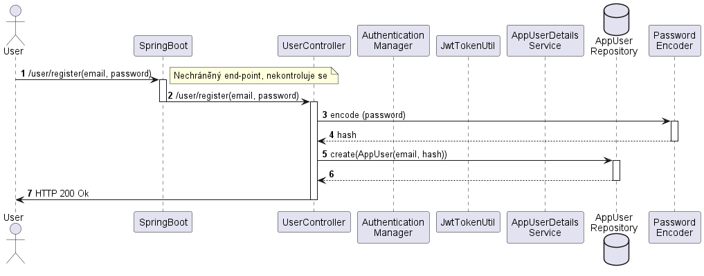
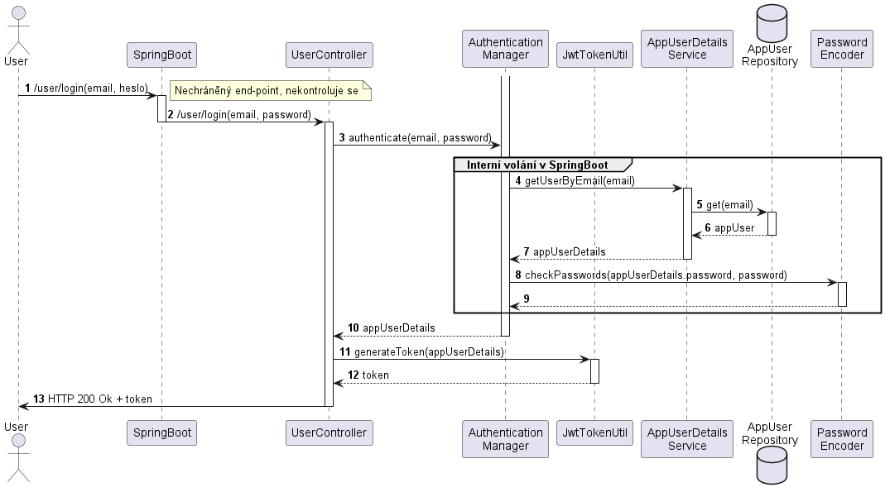
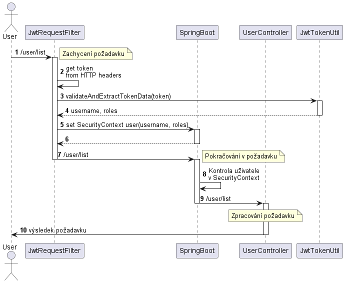

# Implementace JWT v SpringBoot

V této sekci si ukážeme, jak zabezpečit REST rozhraní SpringBoot back-end aplikace s využitím JWT. Bude demonstrována registrace, přihlášení a základní zabezpečení end-pointu pomocí přihlášení a role přiřazené uživateli.


Zdrojové kódy


## Obecný přehled zabezpečení ve SpringBoot

SpringBoot, jakožto komplexní nástroj, má celou svou vlastní infrastrukturu na řešení zabezpečení - autentizace a autorizace - webové aplikace. Interně provozuje vlastní kontext (uvnitř tzv. **SpringBoot Security**), ve kterém má uschované informace o přihlášeném uživateli. Díky tomu je implementace výchozího zabezpečení ve SpringBoot velmi jednoduchá a zároveň mechanismus nabízí velmi široké možnosti přizpůsobení a rozšíření. Na druhou stranu, i jednoduché vlastní řešení zabezpečení (jako v našem případě přidání podpory pro JWT) není bohužel úplně triviální a SpringBoot interně žádnou implementaci pro podporu JWT nenabízí.

V obecném mechanismu se nachází větší množství objektů a pro správnou implementaci zabezpečení je bohužel nutné alespoň jejich základům a principu zabezpečení porozumět.

<figure><figcaption><p>Architektura SpringBoot Security. V obrázku uvedeno nesprávně <code>WebSecurityConfigurerAdapter</code> jako <code>WebSecurityConfigerAdapter</code>. Zdroj: <a href="https://www.bezkoder.com/spring-boot-security-jwt/">https://www.bezkoder.com/spring-boot-security-jwt/</a></p></figcaption></figure>

Při spuštění webové aplikace se v rámci SpringBoot projektu načítá nastavení z **Security konfigurace** - typicky pojmenovaná jako `WebSecurityConfigurer, WebSecurityConfiguration` apod**.** Tato třída definuje základní zabezpečení aplikace. Udává mimo jiné, na které místa v aplikaci je vyžadováno autorizované přípojení (a jak moc), a jakým způsobem se samo zabezpečení realizuje, ale také práci s cors, csfr, sezeními (sessions) a další.


V dřívějších verzích SpringBoot se pro konfiguraci zabezpečení používal potomek třídy`WebSecurityConfigurerAdapter`. Tato třída již není podporována a konfigurace se nově provádí pomocí anotací (tak jak je uvedeno v tomto příkladě).


Pro každý nově příchozí požadavek od klienta je dále nastaven vlastní `OncePerRequestFilter`, což je (zjednodušeně řečeno) mechanismus, který zachytí každý požadavek a před dalším předání do webové aplikace nad ním provede nějakou akci. V našem případě se realizuje kontrola autorizace uživatele. Zjistí se, zda uživatel přes HTTP poskytuje nějaké `Authentication` hlavičky. Pokud ano, z hlavičky se zjistí info o uživateli a to se předá jako žádost do `UserDetailsService`, která vrátí informace o uživateli jako instanci třídy `UserDetails`. Na jejich základě se nastaví instance objektu `UsernamePasswordAuthenticationToken` do interního SecurityContextu (interní část SpringBootu, která se dále stará o kontrolu přístupů, viz dále).&#x20;

## Příprava projektu a prerekvizity

Pro implementaci JWT je třeba založit nový SpringBoot projekt. Zde demonstrovaná verze je SpringBoot 2.7.3 na Java 18, JDK 18. V rámci SpringBoot je třeba přidat reference na "Spring Web" a "Spring Security". Na závislosti použijeme nástroj [Maven](https://www.jetbrains.com/help/idea/maven-support.html), projekt balíme do JAR.

### Reference

Do prázdného projektu je nejdříve přidat požadované reference. SpringBoot nemá interně podporu pro JWT, je třeba si proto pomoci projektem Java JWT: JSON Web Token for Java and Android ([https://github.com/jwtk/jjwt](https://github.com/jwtk/jjwt)) - dále jen jjwt. Odkaz na moduly lze přiložit do projektu přes soubor `pom.xml`:


```xml
<!-- https://mvnrepository.com/artifact/io.jsonwebtoken/jjwt-api -->
<dependency>
    <groupId>io.jsonwebtoken</groupId>
    <artifactId>jjwt-api</artifactId>
    <version>0.11.5</version>
</dependency>
<!-- https://mvnrepository.com/artifact/io.jsonwebtoken/jjwt-impl -->
<dependency>
    <groupId>io.jsonwebtoken</groupId>
    <artifactId>jjwt-impl</artifactId>
    <version>0.11.5</version>
    <scope>runtime</scope>
</dependency>
<dependency>
    <groupId>io.jsonwebtoken</groupId>
    <artifactId>jjwt-jackson</artifactId> <!-- or jjwt-gson if Gson is preferred -->
    <version>0.11.5</version>
    <scope>runtime</scope>
</dependency>
```


Reference obsahují odkaz na obecné rozhraní JWT - `jwtt-api`, jeho konkrétní implementaci - `jjwt-impl` a nástroj pro serializaci JWT obsahu do JSON - `jjwt-jackson`.

Po doplnění obsahu do souboru `pom.xml` nezapomeneme přes Maven stáhnout požadované knihovny.

### Modelové třídy a naplnění daty

V rámci projektu budeme potřebovat jednu základní modelovou třídu `AppUser`, která simuluje uživatele. V reálném projektu by se instance této třídy ukládaly a načítali přes perzistenci do databáze. Třída bude obsahovat e-mail (slouží pro přihlašování), hash hesla a také seznam názvů rolí jako množinu řetězců.


```java
package cz.osu.kip.jwttokendemo;

import java.util.Arrays;
import java.util.HashSet;
import java.util.Set;

public class AppUser {
  private String email;
  private String password;
  private final Set<String> roles = new HashSet<>();

  public AppUser(String email, String password, String... roles) {
    this.email = email;
    this.password = password;
    this.roles.addAll(Arrays.asList(roles));
  }

  public AppUser() {  }

  public String getEmail() {
    return email;
  }

  public String getPassword() {
    return password;
  }

  public Set<String> getRoles() {
    return new HashSet<>(this.roles);
  }
}
```


Dále, pro simulaci načítání a ukládání `AppUser` je třeba vytvořit jednoduchou `AppUserRepository`. Opět, v reálném projektu by tato třída přes JPA ukládala data do databáze. V našem projektu pouze realizuje základní simulaci chování repositáře.


```java
package cz.osu.kip.jwttokendemo;

import org.springframework.stereotype.Repository;

import java.util.*;

@Repository
public class AppUserRepository {
  private final Set<AppUser> users = new HashSet<>();

  public void add(AppUser user) {
    this.users.add(user);
  }

  public Optional<AppUser> get(String email) {
    return users.stream().filter(q -> q.getEmail().equalsIgnoreCase(email)).findFirst();
  }

  public Set<AppUser> getAll() {
    return new HashSet<>(this.users);
  }
}

```



Metoda `get(...)` vrací datový typ `Optional`. Pro bližší informace o tomto typu viz například [Guide to Java 8 Optional](https://www.baeldung.com/java-optional).


Díky anotaci `@Repository` bude možno instanci naší třídy injektovat pomocí dependency injection a anotace `@Autowire`.

Nakonec si pro naplnění dat pomůžeme jednoduchou komponentou, která se spustí automaticky při spuštění projektu - `Initializer.java`:


```java
package cz.osu.kip.jwttokendemo;

import org.slf4j.Logger;
import org.springframework.beans.factory.annotation.Autowired;
import org.springframework.boot.CommandLineRunner;
import org.springframework.security.crypto.password.PasswordEncoder;
import org.springframework.stereotype.Component;

@Component
public class Initializer implements CommandLineRunner
{
  @Autowired private PasswordEncoder passwordEncoder;
  @Autowired private AppUserRepository appUserRepository;
  @Autowired private Logger logger;

  @Override
  public void run(String... args) throws Exception {
    logger.info("Creating new users in AppUserRepository");
    appUserRepository.add(new AppUser(
            "tereza.veverkova@email.cz",
            passwordEncoder.encode("orisek"),
            "ADMIN", "USER"));
    appUserRepository.add(new AppUser(
            "jan.navratil@email.cz",
            passwordEncoder.encode("zahrada"),
            "USER"));
    logger.info("Users inserted.");
  }
}

```



Třída implementující `CommandLineRunner` se automaticky spouští po inicializaci projektu. Pro více informací o `CommandLineRunner` a jeho použití viz například [https://www.javaguides.net/2020/02/spring-boot-commandlinerunner-example.html](https://www.javaguides.net/2020/02/spring-boot-commandlinerunner-example.html).


Po spuštění aplikace (nyní ještě nebude fungovat) se nám v `AppUserRepository` vytvoří dva uživatelé s danými hesly. Každý uživatel má jiné role a je také vhodné si povšimnout šifrování hesel při ukládání - řádky 21, 25 (více dále).

### UserDetails a UserDetailsService - třídy SpringBoot pro práci s uživatelem

Přestože jsme si vytvořili modelové třídy pro práci s informacemi o uživateli, prostředí SpringBoot používá vlastní rozhraní přístup k informacím o uživateli. Základním rozhraním je `UserDetails`, které vyžaduje implementaci základních položek:

* `getUsername()`  pro získání uživatelského jména,
* `getPassword()` pro získání hesla nebo jeho hashe,
* `getAuthorities()` pro získání daných oprávnění uživatele,
* `isAccountNonExpired()` - zda nevypršela časová platnost účtu,
* `isAccountNonLocked()` - zda účet není uzamčený,
* `isCredentialsNonExpired()` - zda nevypršely přihlašovací údaje k účtu (například že si uživatel msí změnit heslo na nové) a
* `isEnabled()` - zda je účet aktivní.

Jelikož se jedná o rozhraní, může si uživatel vybrat, zda bude toto rozhraní implementovat přímo svou modelovou třídou uživatele (tj. v našem případě `AppUser implements UserDetails`, nebo si vytvoří třídu vlastní. První řešení je jednodušší, ale přibaluje na modelovou třídu odpovědnosti navíc. Druhý přístup (vytvoření vlastní třídy) je pracnější, udržuje však model aplikace odstíněný od implementačních požadavků prostředí SpringBoot.

V našem případě vytvoříme jednoduchou implementaci rozhraní přes třídu `AppUserDetails`.  Implementace je primitivní, přes konstruktor umí nastavit jméno, heslo a role uživatele, ostatní atributy se vrací jako konstanty. Zajímavé je předání rolí do konstruktoru jako pole řetězců, ale jejich interní konverze na typ `SimpleGrantedAuthority`, protože rozhraní `UserDetails` vyžaduje authority/oprávnění jako `Collection<GrantedAuthority>`.


```java
package cz.osu.kip.jwttokendemo;

import org.springframework.security.core.GrantedAuthority;
import org.springframework.security.core.authority.SimpleGrantedAuthority;
import org.springframework.security.core.userdetails.UserDetails;

import java.util.Arrays;
import java.util.Collection;
import java.util.HashSet;
import java.util.Set;

public class AppUserDetails implements UserDetails {

  private final String password;
  private final String userName;
  private final Set<GrantedAuthority> roles = new HashSet<>();

  public AppUserDetails(String userName, String password, String... roles) {
    this.password = password;
    this.userName = userName;
    Arrays.stream(roles)
            .map(q -> new SimpleGrantedAuthority(q))
            .forEach(q -> this.roles.add(q));
  }

  @Override
  public Collection<? extends GrantedAuthority> getAuthorities() {
    return this.roles;
  }

  @Override
  public String getPassword() {
    return password;
  }

  @Override
  public String getUsername() {
    return userName;
  }

  @Override
  public boolean isAccountNonExpired() {
    return true;
  }

  @Override
  public boolean isAccountNonLocked() {
    return true;
  }

  @Override
  public boolean isCredentialsNonExpired() {
    return true;
  }

  @Override
  public boolean isEnabled() {
    return true;
  }
}
```



Role se do konstruktoru předávají jako proměnný počet argumentů, tzv. `varargs`. Pro bližší například viz [Variable Arguments (Varargs)](https://www.geeksforgeeks.org/variable-arguments-varargs-in-java/).


Pro získávání instance `UserDetails` se používá implementace `UserDetailsService`. Ta má jednu metodu definující jak vrátit implementaci `UserDetails` podle uživatelského jména. Naše implementace `AppUserDetailsService` si interně připojí `AppUserRepository` a z něj se pokusí zjistit uživatele podle uživatelského jména. Na základě zjištěných informací potom vytvoří objekt `AppUserDetails` s naplněnými hodnotami.


```java
package cz.osu.kip.jwttokendemo;

import org.springframework.beans.factory.annotation.Autowired;
import org.springframework.security.core.userdetails.UserDetails;
import org.springframework.security.core.userdetails.UserDetailsService;
import org.springframework.security.core.userdetails.UsernameNotFoundException;
import org.springframework.stereotype.Service;
import java.util.Optional;

@Service
public class AppUserDetailsService implements UserDetailsService {

  @Autowired
  private AppUserRepository appUserRepository;

  @Override
  public UserDetails loadUserByUsername(String username) throws UsernameNotFoundException {
    Optional<AppUser> user = appUserRepository.get(username);
    if (user.isEmpty())
      throw new UsernameNotFoundException("Username " + username + " unknown.");
    UserDetails ret = new AppUserDetails(
            user.get().getEmail(),
            user.get().getPassword(),
            user.get().getRoles().toArray(String[]::new));
    return ret;
  }
}
```


Díky anotaci `@Service` bude možno instanci této třídy injektovat pomocí dependency injection a anotace `@Autowire`.


Dávejte si od nynějšího kódu pozor na rozdíl mezi:

* `UserDetails` - původní "univerzální" rozhraní SpringBoot s informacemi o uživatelském účtu,
* `AppUserDetails` - naše implementace tohoto rozhraní,
* `UserDetailsService` - původní "univerzální" rozhraní SpringBoot umožňující vrátit "nějakou" implementaci `UserDetails` podle uživatelského jména, a
* `AppUserDetailsService` - naše implementace tohoto rozhraní, která vrací instanci třídy `AppUserDetails` (která samozřejmě implementuje `UserDetails`).



### JwtTokenUtil - Třída pro práci s JWT tokenem

SpringBoot, ani projekt jjwt nemají implementované pomocné metody pro samotnou práci s JWT tokenem. Proto je vhodné si předpřipravit třídu, která při práci s JWT pomůže. Vytvoříme tedy v projektu třídu `JwtTokenUtil`.

Ve třídě nejdříve doplníme konstruktor a třídní proměnné:

* `JWT_TOKEN_VALIDITY` udává interval (v sekundách) jak dlouho bude token platný,
* `secretKey` udává soukromý klíč použitý pro šifrování tokenu
* `key` je předpřipravený objekt vytvořený na základě soukromého klíče použitý k následnému šifrování a dešifrování tokenu (v případě symetrického šifrování)


```java
package cz.osu.kip.jwttokendemo;

import java.io.Serial;
import java.io.Serializable;
import java.security.Key;
import java.util.Date;
import java.util.HashMap;
import java.util.Map;
import java.util.function.Function;

import io.jsonwebtoken.security.Keys;
import org.springframework.beans.factory.annotation.Value;
import org.springframework.security.core.userdetails.UserDetails;
import org.springframework.stereotype.Component;

import io.jsonwebtoken.Claims;
import io.jsonwebtoken.Jwts;
import io.jsonwebtoken.SignatureAlgorithm;

@Component
public class JwtTokenUtil implements Serializable {

  public static final long JWT_TOKEN_VALIDITY = 15 * 60;

  @Value("${jwt.secret}") private String secretKey;
  
  private final Key key;

  public JwtTokenUtil(){
    // key = Keys.hmacShaKeyFor(secretKey.getBytes(StandardCharsets.UTF_8));
    key = Keys.secretKeyFor(SignatureAlgorithm.HS512); //or HS384 or HS256
  }
}

```


Definice klíče je zajímavou záležitostí:

* Jednou z možností je definice vlastního soukromého klíče. V tom případě se klíč zapíše například do konfiguračního souboru `application.properties` jako klíč=hodnota, například `jwt.secret=mujSupertajnyDlouhyKlic...`. Poté lze použít direktivu SpringBoot `@Value("${jwt.secret}")`, která automaticky načte hodnotu z konfiguračního souboru do proměnné. Nevýhodou tohoto přístupu je nutnost definice vlastního, dostatečně dlouhého a bezpečného soukromého klíče a také možnost jeho úniku, pokud se někdo nepovolaný dostane ke konfiguračnímu souboru - řádek 30.
* Druhou možností je využít jeden z nástrojů knihovny jjwt, který umí automaticky vygenerovat vhodný, dostatečně bezpečený a náhodný klíč pro daný šifrovací algoritmus. Tento klíč zůstane pevný po dobu běhu aplikace. Při restartu aplikace se klíč vytvoří nový, čímž se invalidují všechny dříve vytvořené tokeny (což je žádoucí efekt)- řádek 31.


V kódu jsou vhodnou volbou zakomentování v konstruktoru uvedené obě výše uvedené varianty.


### WebSecurityConfig - nastavení SpringBoot konfigurace

Nyní vytvoříme hlavní třídu, která nastaví SpringBootu informace o tom, jak bude probíhat ověřovaní uživatele.

V projektu vytvoříme třídu `WebSecurityConfig` a přidáme jí anotace definující, že se jedná o konfigurační soubor, konfiguraci webového zabezpečení a nastavení zabezpečení.&#x20;

Následně do ní doplníme metodu definující chování v základním stavu - řekneme, že žádný end-point není chráněný (není se nutno přihlašovat) a že se nemají používat sessions - nepotřebujeme je.


```java
package cz.osu.kip.jwttokendemo;

import org.springframework.context.annotation.Bean;
import org.springframework.context.annotation.Configuration;
import org.springframework.security.config.annotation.method.configuration.EnableGlobalMethodSecurity;
import org.springframework.security.config.annotation.web.builders.HttpSecurity;
import org.springframework.security.config.annotation.web.configuration.EnableWebSecurity;
import org.springframework.security.config.http.SessionCreationPolicy;
import org.springframework.security.web.SecurityFilterChain;

@Configuration
@EnableWebSecurity
@EnableGlobalMethodSecurity(prePostEnabled = true, securedEnabled = true, jsr250Enabled = true)
public class WebSecurityConfig {
  
  @Bean
  public SecurityFilterChain filterChain(HttpSecurity http) throws Exception {
    http.csrf().disable()
            .authorizeRequests()
            .anyRequest().permitAll()
            .and().sessionManagement().sessionCreationPolicy(SessionCreationPolicy.STATELESS);

    return http.build();
  }
}

```



Důležité je v `@EnableGlobalSecurity` nastavit vlastnost `jsr250Enabled`, která definuje, že SpringBoot má používat také role k ověřování přístupů. V našem příkladu budeme ukazovat i použití rolí a bez toho to nastavení nebude ověřování přístupů na end-pointy pomocí názvů rolí fungovat!


### UserController - základní end-point

Dále vytvoříme základní testovací end-point pro získání uživatelů.

Vytoříme třídu `UserController`, přiřadíme mu odpovídající mapování a jednoduchý end-point:


```java
package cz.osu.kip.jwttokendemo;

import org.springframework.beans.factory.annotation.Autowired;
import org.springframework.http.ResponseEntity;
import org.springframework.web.bind.annotation.GetMapping;
import org.springframework.web.bind.annotation.RequestMapping;
import org.springframework.web.bind.annotation.RestController;

import java.util.List;

@RestController
@RequestMapping("/user")
public class UserController {

  @Autowired private AppUserRepository appUserRepository;

  @GetMapping("/list")
  public ResponseEntity<List<String>> listUsers() {
    List<String> ret = appUserRepository.getAll().stream()
            .filter(q -> q.getRoles().contains("USER"))
            .map(q -> q.getEmail())
            .sorted()
            .toList();
    return ResponseEntity.ok(ret);
  }

}

```


### Shrnutí

Vytvořili jsme základní projekt, přidali pro něj modelové třídy uživatele, i třídy uživatele pro prostředí SpringBoot. Nastavili jsme obecný přístup do aplikace bez zabezpečení a vytvořili jednoduchý end-point.

Aplikace nyní jde spustit a při požadavku na `/user/list` vrátí odpovídající uživatele.

## Registrace nového uživatele

<figure><figcaption></figcaption></figure>

Při registraci pošle:

1. uživatel požadavek na `/user/register` a přiloží uživatelské jméno a heslo nového uživatele. Protože registrační end-point nepotřebuje ověření (nedávalo by to smysl, pak by mohl nového uživatele registrovat pouze existující uživatel), ihned...
2. ... se požadavek přepošle na odpovídající controller.
3. Controller zahashuje heslo předdefinovaným `passwordEncoder` (viz třída `BeansProvider`)
4. ... a získá otisk hesla.
5. Následně požádá repository o vytvoření nového uživatele dle e-mailu a otisku hesla.
6. Repository odpoví (měla by zde být kontrola na již existující e-mail, ale pro jednoduchost ji vynecháme).
7. Controller pošle uživateli zprávu, že se operace zdařila - HTTP 200 Ok.

Pro implementaci tedy musíme vytvořit end-point controller.

### UserController - přidání end-pointu registrace uživatele

Do třídy `UserController` nejdříve přidáme třídní proměnnou získávající `paswordEncoder` z DI. Dále přidáme nový jednoduchý endpoint (rozšiřujeme existující třídu, přidáme kód):

```java
  @Autowired private PasswordEncoder passwordEncoder;

  @PostMapping("/signup")
  public ResponseEntity signUp(String email, String password) {
    AppUser appUser = new AppUser(
            email,
            passwordEncoder.encode(password),
            "USER");
    appUserRepository.add(appUser);
    return ResponseEntity.ok(null);
  }
```

Nový uživatel se tedy ukládá s otiskem hesla (**nikoliv a nikdy s původním heslem**) a automatickou rolí `USER`.

### Shrnutí

Vidíme, že implementace registrace je poměrně jednoduchá. Samozřejmě, v komplexní aplikaci by ještě následovala pasáž vyžadující ověření uživatele pomocí odkazu e-mailu.

Můžeme tedy nyní aplikaci spustit a poslat POST požadavek na `/user/signup` se zadanými hodnotami `email` a `password`. Aplikace by měla vrátit stav HTTP 200 Ok. Následně můžme vznést GET dotaz na `/user/list` a měl by se nám vrátit i náš nově vytvořený uživatel.

## Přihlášení uživatele

<figure><figcaption></figcaption></figure>

Při přihlášení:

1. Pošle uživatel požadavek na `/user/login` spolu se jménem a heslem. Tento end-point není zabezpečený (jinak by se mohl přihlásit pouze už přihlášený uživatel, což je nesmysl).
2. SpringBoot tedy přepošle požadavek na správný `UserController`.
3. Ten využije vložený `authenticationManager` a zavolá jeho metodu `authenticate()`, které předá email a heslo. Následné bloky 4, 8 a 9 se dělají interně ve SpringBoot a  jsou zmíněny pouze pro pochopení filosofie autentizace.
4. `authenticationManager` požádá `appUserDetailsService` o poskytnutí `UserDetails`.
5. `appUserDetailsService` požádá `appUserRepository` o odpovídajícího uživatele...
6. ... a vrátí se mu objekt `appUser`.
7. `AppUserDetailsService` převede `appUser` na `appUserDetails` a ...
8. ... požádá `passwordEncoder` o kontrolu hesla.
9. Pokud je heslo v pořádku...
10. ... `AppUserDetailsService` vrátí vytvořený objekt `AppUserDetails` (zabalený v objektu `Authentization`, viz implementace dále).
11. `UserController` pořádá `jwtTokenUtil` o vygenerování tokenu...
12. ... který se vrátí a controller jej ...
13. ... předá zpátky uživateli.

Uživatel si tento token uloží a bude jej příkládat ve všech dalších požadavcích.

Všimněte si, že token se nikam na straně serveru **neukládá**. Token je samopopisný a obsahuje podepsanou informaci o tom, kdo je jeho subjekt, tedy náš `appUser`. Token je platný do vypršení jeho expirace.

### UserController - implementace přihlašovacího end-pointu

Do třídy `UserController` nejdříve potřebujeme doplnit přes DI dva objekty, které budeme používat - `authenticationManager` a `jwtTokenUtil`. Druhý z nich je již dostupný jako beana (viz `BeansProvider`), k prvnímu se vrátíme za chvilku. Dále do třídy vložíme kód metody endpointu:


```java
  @Autowired  private AuthenticationManager authenticationManager;
  @Autowired  private JwtTokenUtil jwtTokenUtil;

  @PostMapping("/login")
  public ResponseEntity<String> login(String email, String password){
    Authentication authentication;
    try {
      authentication = authenticationManager.authenticate(
        new UsernamePasswordAuthenticationToken(email, password));
    } catch (DisabledException | BadCredentialsException e) {
      return ResponseEntity.badRequest().body("Invalid credentials.");
    }
    final UserDetails userDetails = (AppUserDetails) authentication.getPrincipal();
    final String token = jwtTokenUtil.generateToken(userDetails);
    return ResponseEntity.ok(token);
  }
```


Všimněme si volání ověření, které se provede automaticky přes `authenticationManager.authenticate()` (řádek 8). Vrací se objekt `Authentiation`, který obsahuje informace o uživateli, včetně rolí. My si z objektu vytáhneme ověřovanou osobu - `authentication.getPrincipal()` (řádek 12), a z ní necháme `jwtTokenUtil` vygenerovat token (řádek 13), který vracíme uživateli.

### AuthenticationManager - zavedení a definice beany

Rozšířený kód `UserController` bude hlásit chybu u `@Autowired AuthenticationManager`, že tento objekt nezná. Proto jej nakonfigurujeme a zavedeme do `WebSecurityConfig` - přidáme dvě pomocné proměnné přes DI - `passwordEncoder` a `appUserDetailService`, a následně vlastní konfiguraci beany:

```java
  @Autowired private PasswordEncoder passwordEncoder;
  @Autowired private AppUserDetailsService appUserDetailsService;

  @Bean
  public AuthenticationManager authenticationManagerBean(HttpSecurity http) 
    throws Exception {
    return http.getSharedObject(AuthenticationManagerBuilder.class)
            .userDetailsService(appUserDetailsService)
            .passwordEncoder(passwordEncoder)
            .and()
            .build();
```

V kódu nastavujeme, co se má používat jako `userDetailsService` a jaký se má používat `passwordEncoder`.

### JwtTokenUtil - generování tokenu

Do `JwtTokenUtil` přidáme metodu, která bude generovat token:


```java
  public String generateToken(UserDetails userDetails) {
    Map<String, Object> customClaims = new HashMap<>();
    String rolesString = userDetails.getAuthorities().stream()
            .map(q->q.toString())
            .collect(Collectors.joining(","));
    customClaims.put("roles", rolesString);

    return Jwts.builder()
            .setClaims(customClaims)
            .setSubject(userDetails.getUsername())
            .setIssuedAt(new Date(System.currentTimeMillis()))
            .setExpiration(new Date(System.currentTimeMillis() + JWT_TOKEN_VALIDITY * 1000))
            .signWith(key)
            .compact();
  }
```


Metoda vezme vstup `userDetails`, vytáhne z něj role a vytvoří z nich dlouhý řetězec oddělený čárkami (řádek 3) a vloží jej do soukromé běžné Java mapy pod klíčem `roles` (řádek 6).

Následně se vytvoří jwt-token-builder (řádek 8), který nastaví do tokenu prohlášení rolí (řádek 9), nastaví uživatele (řádek 10), nastaví datum vytvoření a expirace tokenu (řádek 12), token podepíše (čádek 13) a výsledek vrátí.


Může nastat stav, kdy má vydávající server lehce odlišný čas než server kontrolující token. Potom by mohl být odmítnut jako platný i token, protože nesedí časy serverů. Takovou situaci je vhodné ošetřit lehkou úpravou (rozšířením) claimů `nbf` a `exp`tak, aby se platnost tokenu lehce (o sekundy) rozšířila na obě strany, aby k tomuto problému nedošlo. Samozřejmě, pokud vždy platí, že vydávající a kontrolující objekt je tentýž, tato situace nenastane a rozšíření platnosti se dělat nemusí.


### Shrnutí

V projektu jsme vytvořili nový end-point na přihlášení uživatele. Nastavili jsme beanu `AuthenticationManager` a přidali do `JwtTokenUtil` metodu na generování JWT/JWS tokenu, který se vrací uživateli.

Nyní lze aplikaci spustit. Pokud uživatel pošle POST požadavek na `/user/login` a zadá správný e-mail a heslo (viz třída `Initializer` a tvorba nových uživatelů), vrátí se mu odpověď HTTP 200 Ok a také JWT token.

## Ověření uživatele

<figure><figcaption></figcaption></figure>

Při dalších požadavcích, které budou vyžadovat ověření:

1. Nově vytvoření `JwtRequestFilter` zachytí požadavek.
2. Pokusí se vytáhnout JWT token z HTTP hlavičky `Authorization`.
3. Token pošle do `JwtTokenUtil` s žádostí o dekódování. Zde se token zvaliduje (není-li definováno jinak, tak minimálně na časovou validitu, tj. claims `nbf` a `exp` a ...
4. ... vrátí se zpět uživatelské jméno a role (případně další prohlášení).
5. Vytvoří se pomocný objekt a předá se do SpringBoot SecurityContext. SpringBoot tak bude od nynějška vědět, ...
6. ...kdo tento požadavek vyvolal a jaká bude mít práva.
7. Po dokončení přepošle `JwtRequestToken` požadavek k dalšímu zpracování.
8. Další bezpečnostní vrstva ve SpringBoot zjistí, že požadavek je chráněn, a zároveň z SpringBoot SecurityContext zjistí, kdo je aktuálně přihlášen a jaká má práva.
9. Po úspěšném ověření je požadavek předán dále ke zpracování patřičnému controlleru, ...
10. ... který po zpracování vrátí výsledek.

### WebSecurityConfig - úprava přístupnosti end-pointů

Nyní, když máme hotovou autentizaci a řešíme autorizaci, je vhodné upravit nastavení přístupnosti end-pointů. Obecně bychom měli aplikaci psát restriktivně - tj. vybrané end-pointy nechat volně přístupné, ale všechny ostatní zakázat. Proto v našem případě upravíme ve třídě `WebSecurityConfig` v metodě `filterChain()` práva na:

```java
    http.csrf().disable()
            .authorizeRequests()
            .antMatchers("/user/login", "/user/signin/", "/user/list").permitAll()
            .anyRequest().authenticated()
            .and().sessionManagement().sessionCreationPolicy(SessionCreationPolicy.STATELESS);
```

### JwtFilterChain - filtrování a hledání JWT tokenu v požadavcích

Dalším krokem bude vytvoření nového tzv. filtru, který vložíme do sekvence filtrů, kterými prochází každý HTTP požadavek. Náš filtr v sekvenci zachytí požadavek, zkusí zjistit, zda obsahuje validní JWT token, a pokud ano, tak uživatele přihlásí do SpringBoot SecurityContextu tak, aby SpringBoot věděl, jaký uživatel požadavek vyvolal. Potom náš filtr předá požadavek k dalšímu zpracování.

V projektu vytvoříme třídu `JwtRequestFilter`, která bude dědit ze třídy `OncePerRequestFilter` a implementujeme metodu `doFilterInternal()`:


```java
package cz.osu.kip.jwttokendemo;

import io.jsonwebtoken.ExpiredJwtException;
import io.jsonwebtoken.MalformedJwtException;
import io.jsonwebtoken.PrematureJwtException;
import io.jsonwebtoken.security.SignatureException;
import org.springframework.beans.factory.annotation.Autowired;
import org.springframework.security.authentication.UsernamePasswordAuthenticationToken;
import org.springframework.security.core.context.SecurityContextHolder;
import org.springframework.security.core.userdetails.UserDetails;
import org.springframework.security.web.authentication.WebAuthenticationDetailsSource;
import org.springframework.stereotype.Component;
import org.springframework.web.filter.OncePerRequestFilter;

import javax.servlet.FilterChain;
import javax.servlet.ServletException;
import javax.servlet.http.HttpServletRequest;
import javax.servlet.http.HttpServletResponse;
import java.io.IOException;

@Component
public class JwtRequestFilter extends OncePerRequestFilter {

  @Autowired private JwtTokenUtil jwtTokenUtil;

  @Override
  protected void doFilterInternal(HttpServletRequest request, HttpServletResponse response, FilterChain filterChain)
          throws ServletException, IOException {
    final String requestTokenHeader = request.getHeader("Authorization");

    if (requestTokenHeader != null && requestTokenHeader.startsWith("Bearer ")) {
      String jwtToken = requestTokenHeader.substring(7);

      boolean isJwtTokenValid = false;
      try {
        isJwtTokenValid = jwtTokenUtil.isTokenValid(jwtToken);
      } catch (SignatureException ex) {
        logger.info("JWT token signature issue");
      } catch (MalformedJwtException ex){
        logger.info("JWT token invalid format");
      } catch (PrematureJwtException ex){
        logger.info("JWT token accessed before its validity.");
      } catch (ExpiredJwtException ex){
        logger.info("JWT token expired.");
      }

      if (isJwtTokenValid) {
        String userName = jwtTokenUtil.getClaimsFromToken(jwtToken).getSubject();
        String[] roles = jwtTokenUtil.getRolesFromToken(jwtToken);
        UserDetails userDetails = new AppUserDetails(userName, null, roles);
        UsernamePasswordAuthenticationToken upat = new UsernamePasswordAuthenticationToken(
                userDetails, null, userDetails.getAuthorities());
        upat.setDetails(new WebAuthenticationDetailsSource().buildDetails(request));
        SecurityContextHolder.getContext().setAuthentication(upat);
      } else {
        logger.info("JWT token invalid.");
      }
    } else {
      logger.warn("JWT Token does not begin with Bearer String");
    }
    filterChain.doFilter(request, response);
  }
}

```


V metodě zjistíme, zda existuje JWT token (řádek 29, 31). Pokud ano, token předáme k validaci (řádek 36). Pokud validace nezpůsobí chybu, na základě dat z tokenu (uživatele a rolí) vytvoříme objekt `UserDetails` (řádek 46-50), z něj odvodíme (řádky 51-53) objekt `UserNamePasswordAuthenticationToken` a tento předáváme do SpringBoot SecurityContext (řádek 54). Nakonec filter předá zpracování dále (řádek 61).

### WebSecurityConfig II - přidání filtru do sekvence filtrů

Výše vytvořený filtr `JwtRequestFilter` musí být v SpringBoot explicitně přidán do sekvence filtrů spouštěných při zpracování požadavků. Daný příkaz doplníme opět do třídy `WebSecurityConfig`, na konec funkce `filterChain()`. Kompletní finální kód třídy `WebSecurityConfig` tedy bude:


```java
package cz.osu.kip.jwttokendemo;

import org.springframework.beans.factory.annotation.Autowired;
import org.springframework.context.annotation.Bean;
import org.springframework.context.annotation.Configuration;
import org.springframework.security.authentication.AuthenticationManager;
import org.springframework.security.config.annotation.authentication.builders.AuthenticationManagerBuilder;
import org.springframework.security.config.annotation.method.configuration.EnableGlobalMethodSecurity;
import org.springframework.security.config.annotation.web.builders.HttpSecurity;
import org.springframework.security.config.annotation.web.configuration.EnableWebSecurity;
import org.springframework.security.config.http.SessionCreationPolicy;
import org.springframework.security.crypto.password.PasswordEncoder;
import org.springframework.security.web.SecurityFilterChain;
import org.springframework.security.web.authentication.UsernamePasswordAuthenticationFilter;

@Configuration
@EnableWebSecurity
@EnableGlobalMethodSecurity(prePostEnabled = true, securedEnabled = true, jsr250Enabled = true)
public class WebSecurityConfig {

  @Autowired private PasswordEncoder passwordEncoder;
  @Autowired private AppUserDetailsService appUserDetailsService;

  @Bean
  public AuthenticationManager authenticationManagerBean(HttpSecurity http) throws Exception {
    return http.getSharedObject(AuthenticationManagerBuilder.class)
            .userDetailsService(appUserDetailsService)
            .passwordEncoder(passwordEncoder)
            .and()
            .build();
  }

  @Autowired private JwtRequestFilter jwtRequestFilter;

  @Bean
  public SecurityFilterChain filterChain(HttpSecurity http) throws Exception {
    http.csrf().disable()
            .authorizeRequests()
            .antMatchers("/user/login", "/user/signin/", "/user/list").permitAll()
            .anyRequest().authenticated()
            .and().sessionManagement().sessionCreationPolicy(SessionCreationPolicy.STATELESS);

    http.addFilterBefore(jwtRequestFilter, UsernamePasswordAuthenticationFilter.class);

    return http.build();
  }
}

```


Filtr byl vložen přes DI na řádku 33 a přidán do sekvence filtrů na řádku 43.

### JwtTokenUtil - implementace ověření tokenu a vyčítání prohlášení

Nyní musíme do funkce `JwtTokenUtil` doplnit tři funkce pro validaci a vyčítání prohlášení z tokenu.&#x20;

Funkce pro vyčtení všech prohlášení je založena na knihovně jjwt:

```java
  public Claims getClaimsFromToken(String token) {
    return Jwts.parserBuilder()
            .setSigningKey(key)
            .build()
            .parseClaimsJws(token)
            .getBody();
  }
```

Funkce vytvoří parsovací objekt, podepíše ho klíčem a následně funkcí `parseClaimsJws()` vyčte prohlášení, která vrátí.

Funkce pro vyčtení rolí je vlastně jen zapouzdření parsování řetězce rolí do samostatného pole řetězců:

```java
  public String[] getRolesFromToken(String token) {
    Claims claims = getClaimsFromToken(token);
    String rolesString = claims.get("roles", String.class);
    return rolesString == null ? new String[0] : rolesString.split(",");
  }
```

Nakonec, funkce pro validaci tokenu bude nejjednodušší. Je totiž založena na funkci `getClaimsFromToken()` a její interní volání `parseClaimsJws()`, které způsobí chybu, pokud má token špatný formát, je pozměněný, nebo nesedí čas platnosti tokenu. Volání tedy bude pouze:

```java
  public Boolean isTokenValid(String token) {
    getClaimsFromToken(token); // throws an exception in the case of an issue
    return true;
  }
```

Do funkce by bylo samozřejmě možno dopsat další kontrolu prohlášení (zejména kdo token vydal - chceme ještě jednou kontrolovat, zda je uživatel správný a platný?, nebo audience).

V případě, že se pokusíme číst prohlášení z tokenu přes `...parseClaimsJws(token)...`, mohou nastat výjimky:

* `SignatureException` - pokud podpis tokenu nesedí na obsah,
* `MalformedJwtException` - pokud token není ve správném formátu,
* `PrematureJwtExeption` - pokud platnost tokenu ještě nenastala (viz claim `nbf`),
* `ExpiredTokenException` - pokud platnost tokenu již uplynula (viz claim `exp`).

Kompletní kód třídy `JwtTokenUtil` tedy bude:


```java
package cz.osu.kip.jwttokendemo;

import java.io.Serial;
import java.io.Serializable;
import java.security.Key;
import java.util.Date;
import java.util.HashMap;
import java.util.Map;
import java.util.function.Function;
import java.util.stream.Collectors;

import io.jsonwebtoken.security.Keys;
import org.springframework.beans.factory.annotation.Value;
import org.springframework.security.core.userdetails.UserDetails;
import org.springframework.stereotype.Component;

import io.jsonwebtoken.Claims;
import io.jsonwebtoken.Jwts;
import io.jsonwebtoken.SignatureAlgorithm;

@Component
public class JwtTokenUtil implements Serializable {

  public static final long JWT_TOKEN_VALIDITY = 15 * 60;

  @Value("${jwt.secret}") private String secretKey;

  private final Key key;

  public JwtTokenUtil(){
    // key = Keys.hmacShaKeyFor(secretKey.getBytes(StandardCharsets.UTF_8));
    key = Keys.secretKeyFor(SignatureAlgorithm.HS512); //or HS384 or HS256
  }

  public String generateToken(UserDetails userDetails) {
    Map<String, Object> customClaims = new HashMap<>();
    String rolesString = userDetails.getAuthorities().stream()
            .map(q->q.toString())
            .collect(Collectors.joining(","));
    customClaims.put("roles", rolesString);

    return Jwts.builder()
            .setClaims(customClaims)
            .setSubject(userDetails.getUsername())
            .setIssuedAt(new Date(System.currentTimeMillis()))
            .setExpiration(new Date(System.currentTimeMillis() + JWT_TOKEN_VALIDITY * 1000))
            .signWith(key)
            .compact();
  }

  public Claims getClaimsFromToken(String token) {
    return Jwts.parserBuilder()
            .setSigningKey(key)
            .build()
            .parseClaimsJws(token)
            .getBody();
  }

  public String[] getRolesFromToken(String token) {
    Claims claims = getClaimsFromToken(token);
    String rolesString = claims.get("roles", String.class);
    return rolesString == null ? new String[0] : rolesString.split(",");
  }

  public Boolean isTokenValid(String token) {
    getClaimsFromToken(token); // throws an exception in the case of an issue
    return true;
  }
}

```


### UserController - doplnění end-pointu pro získání administrátorů

Poslední jednoduchou akcí bude doplnění end-pointu pro získání všech administrátorů `/user/listAdmin`. Do `UserController` doplníme funkci `getAdmins()`:

```java
  @GetMapping("/listAdmin")
  public ResponseEntity<List<String>> listAdmins() {
    List<String> ret = appUserRepository.getAll().stream()
            .filter(q -> q.getRoles().contains("ADMIN"))
            .map(q -> q.getEmail())
            .sorted()
            .toList();
    return ResponseEntity.ok(ret);
  }
```

Protože tento end-point není vyjmenovaný v `permitAll()` endpointech v `WebSecurityConfig`, je bez přihlášení uživatele nepřístupný.

### Shrnutí

Tím je implementace ověření hotova. Vytvořili jsme filtr, který zachytí každý HTTP požadavek. Pokusí se z něj zjistit validní JWT token, který rozbalí do Spring SecurityContextu. Doplnili jsme také jednoduchý testovací požadavek.

Nyní můžeme řešení vyzkoušet. Lze vytvořit GET požadavek na `/user/list`, který projde v pořádku (není chráněn), ale GET požadavek na `/user/listAdmin` vrátí chybu HTTP 403 Forbidden. Nyní se lze přihlásit - získat token pomocí správného e-mailu a hesla přes POST na `/user/login` a obdržet token. Nyní na požadavku `/user/listAdmin` přejít do záložky `Authorization`, vybrat položku `Bearer Token` a do hodnoty vložit JWT token. Opětovný požadavek by měl vrátit jméno administrátora.

## Odhlášení uživatele

Odhlášení uživatele není při použití JWT na back-endu jednoduchá záležitost. Jelikož je uživatel autorizován JWT tokenem, je jeho přihlášení obecně platné, dokud je platný JWT token, tj. do jeho expirace nebo změny hesla.

Na první pohled jednoduchou variantou, jak tento problém obejít, je udržení black-listu odhlášených tokenů na serveru a příchozí tokeny s nimi porovnávat. Pokud však:

* jsou tokeny udrženy v paměti a chceme používat fixní podepisovací klíč pro JWS, pak se při restartu aplikace seznam odmítnutých tokenů smaže a všechny tokeny budou znovu platné;
* jsou tokeny drženy v databázi, je přístup do databáze při zjišťování validity tokenu velmi pomalý. Řešením tohoto problému může být použití specializovaných velmi rychlých databází.

Stejný efekt má případné zablokování uživatele v systému. Ač je uživatelský účet neaktivní (nebo smazaný) a nelze se přes něj přihlásit, vydané tokeny budou platné až do jejich expirace. Proto je vhodné na toto myslet při návrhu doby expirace tokenu.

## Přístupnost end-pointu podle role

Celé řešení je nyní připraveno nejen na ověřování end-pointů, ale také jejich restrikci podle role. Vše, co je třeba udělat, je nastavit konkrétním end-pointům požadované role. V našem případě budeme chtít, aby end-point `/user/listAdmin` byl přístupný pouze pro administrátory. Upravíme tedy deklaraci v `WebSecurityConfig.filterChain()` na:

```java
    http.csrf().disable()
            .authorizeRequests()
            .antMatchers("/user/login", "/user/signin/", "/user/list").permitAll()
            .antMatchers("/user/listAdmin").hasAuthority("ADMIN")
            .anyRequest().authenticated()
            .and().sessionManagement().sessionCreationPolicy(SessionCreationPolicy.STATELESS);
```

## Vlastní chyba při neúspěšné autorizaci

SpringBoot při neúspěšné autorizaci vrací automaticky HTTP 403 Forbidden. Tento stav lze jednoduše předefinovat vlastním způsobem, a to vytvořením nové třídy `JwtAuthenticationEntryPoint` - tato třída musí implementovat rozhraní `AuthenticationEntryPoint`. Rozhraní vynutí jednu metodu `commence()`, ve které doplníme, co se má stát (typicky vlastní návrat chyby):


```java
package cz.osu.kip.jwttokendemo;

import org.springframework.security.core.AuthenticationException;
import org.springframework.security.web.AuthenticationEntryPoint;
import org.springframework.stereotype.Component;

import javax.servlet.http.HttpServletRequest;
import javax.servlet.http.HttpServletResponse;
import java.io.IOException;
import java.io.Serial;
import java.io.Serializable;

@Component
public class JwtAuthenticationEntryPoint implements AuthenticationEntryPoint, Serializable {

  @Serial private static final long serialVersionUID = -7858869558953243875L;

  @Override
  public void commence(HttpServletRequest request, HttpServletResponse response,
                       AuthenticationException authException) throws IOException {

    // only an example of different possibilites
    // response.setStatus(200);
    // response.getWriter().write("There is some authentication issue.");
    response.sendError(HttpServletResponse.SC_UNAUTHORIZED);
  }
}


```


Dalším krokem bude oznámení SpringBootu, že má tento point využívat. Vrátíme se do souboru `WebSecurityConfig` a doplníme do ní bean od tohoto entry-pointu a jeho připojení do bezpečnostního mechanismu (řádek 1, 10):


```java
@Autowired private JwtAuthenticationEntryPoint jwtAuthenticationEntryPoint;

  @Bean
  public SecurityFilterChain filterChain(HttpSecurity http) throws Exception {
    http.csrf().disable()
            .authorizeRequests()
            .antMatchers("/user/login", "/user/signin/", "/user/list").permitAll()
            .antMatchers("/user/listAdmin").hasAuthority("ADMIN")
            .anyRequest().authenticated()
            .and().exceptionHandling().authenticationEntryPoint(jwtAuthenticationEntryPoint)
            .and().sessionManagement().sessionCreationPolicy(SessionCreationPolicy.STATELESS);

    http.addFilterBefore(jwtRequestFilter, UsernamePasswordAuthenticationFilter.class);

    return http.build();
  }
```


Nyní se bude po neúspěšné autorizaci zpracovávat `JwtAuthenticationEntryPoint`.
