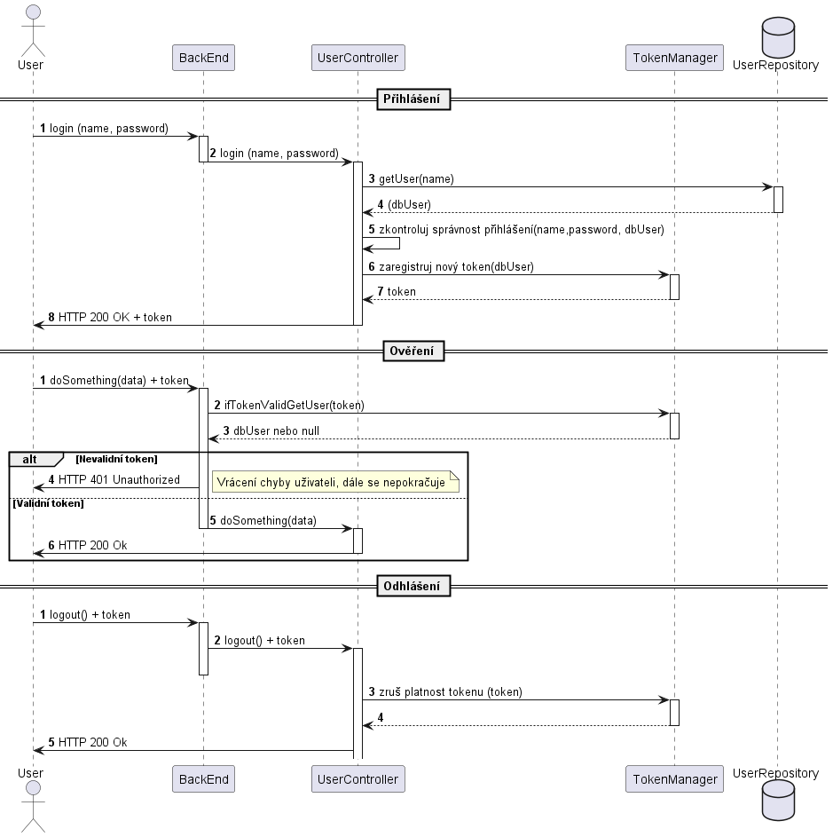
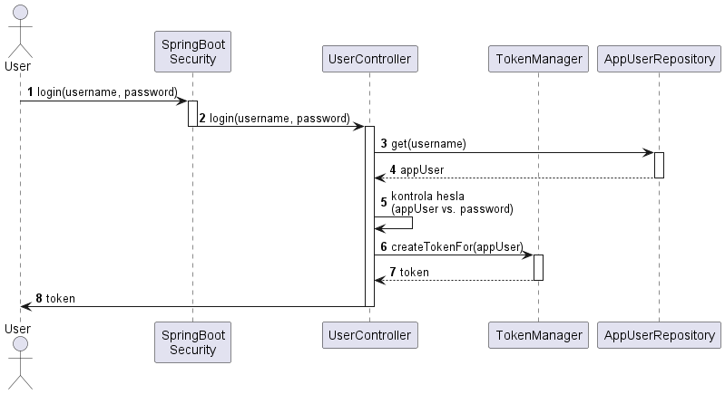
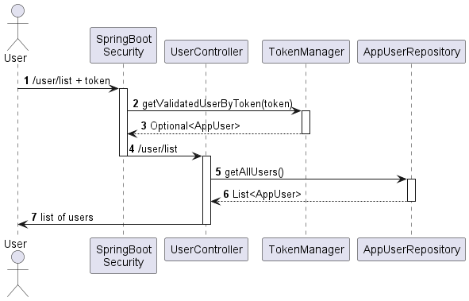
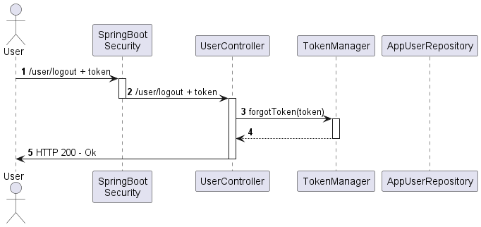

# Primitivní autentizace a autorizace REST služby

V této sekci si ukážeme, jak primitivně zabezpečet aplikaci pro přístup na end-pointy přihlášeným uživatelům. Řešení ukázané na této stránce má sloužit pouze jako základní prezentace pro uvědomění si principů používaných při zabezpečení aplikace. Později bude představeno komplexní řešení založené na JWT a využívající plně možností prostředí SpringBoot.

Znovu - zde ukázané řešení tedy v praxi nepoužívejte. Slouží pouze pro objasnění  základních principů pro neseznámeného uživatele.


Zdrojové kódy


## Základní princip

Komunikace s end-pointy REST API je v základním nastavení bezestavová. To znamená, že pro end-point nerozpozná, že dva po sobě příchozí požadavky od stejného uživatele jsou opravdu od stejného uživatel. Aby end-point věděl, že požadavek posílá nějaký konkrétní uživatel, musí uživatel end-pointu tuto informaci nějakým způsobem sdělit.&#x20;

Obecně je toto řešení pro komunikaci mezi front-endem a back-endem založeno na tokenech. Token je krátký textový řetězec, který jednoznačně identifikuje uživatele.&#x20;

Při přihlašování uživatel pošle na přihlašovací end-point svoje údaje (jméno+heslo). End-point sáhne do databáze a zjistí, zda uživatel poskytl správné údaje. Pokud ano, vygeneruje a uloží si dvojici (token, uživatel) a uživateli zpátky vrátí token.

Při dalších požadavcích na jakýkoliv end-point uživatel tento token přiloží. End-point ověří, zda je token platný a k jakému uživateli patří a na základě uživatele zjistí, zda má uživatel právo provést danou operaci/end-point. Pokud má uživatel práva, end-point provede danou operaci a vrácí výsledek. V případě nevalidního/chybějícího tokenu by měl back-end vrátit HTTP chybu 401 Unauthorized. V případě, že uživatel je přihlášený, ale nemá dostatečná práva, měl by dostat zpět chybu HTTP 403 Forbidden.

<figure><figcaption></figcaption></figure>

V další části vytvoříme velmi jednoduchý projekt ve SpringBoot umožňující realizovat výše uvedené schéma.

## Příprava projektu a prerekvizity

V úvodní sekci vytvoříme základní kostru projektu a obecné třídy, které budeme pro práci potřebovat.

### Vytvoření kostry projektu SpringBoot

Přes [Spring Initializr](https://www.jetbrains.com/help/idea/spring-boot.html) v Idea vytvoříme SpringBoot projekt. Aktuální demonstrace proběhne ve verzi Java 18 a SpringBoot 2.7.3. Do SpringBoot přiložíme `SpringBoot Web` pro implementaci REST rozhraní a `SpringBoot Security` poskytující zabezpečovací funkcionality.

### AppUser a AppUserRepository - příprava modelových tříd uživatele

V rámci projektu budeme potřebovat jednu základní modelovou třídu `AppUser`, která simuluje uživatele. V reálném projektu by se instance této třídy ukládaly a načítali přes perzistenci do databáze. Třída definuje uživatelské jméno a heslo.


```java
package cz.osu.kip.simpletokendemo;

public class AppUser {
  private final String username;
  private final String password;

  public AppUser(String username, String password) {
    this.username = username;
    this.password = password;
  }

  public String getUsername() {
    return username;
  }

  public String getPassword() {
    return password;
  }
}
```


Dále, pro simulaci načítání a ukládání `AppUser` je třeba vytvořit jednoduchou `AppUserRepository`. Opět, v reálném projektu by tato třída přes JPA ukládala data do databáze. V našem projektu pouze realizuje základní simulaci chování repositáře. Definujeme funkci pro přidání uživatele, získání uživatele podle uživatelského jména a získání všech uživatelů.


```java
package cz.osu.kip.simpletokendemo;

import org.springframework.stereotype.Repository;
import java.util.ArrayList;
import java.util.List;
import java.util.Optional;

@Repository
public class AppUserRepository {
  private final List<AppUser> users = new ArrayList<>();

  public void add(AppUser user) {
    this.users.add(user);
  }

  public Optional<AppUser> get(String username) {
    return users.stream()
            .filter(q -> q.getUsername().equalsIgnoreCase(username))
            .findFirst();
  }

  public List<AppUser> getAll() {
    return new ArrayList<>(this.users);
  }
}
```



Metoda `get(...)` vrací datový typ `Optional`. Pro bližší informace o tomto typu viz například [Guide To Java 8 Optional](https://www.baeldung.com/java-optional).


Díky anotaci `@Repository` bude možno instanci třídy `AppUserRepository` injektovat pomocí dependency injection a anotace `@Autowire`.

### TokenManager - třída pro práci s tokenem

V projektu budeme potřebovat třídu zapouzdřující jednoduchou práci s tokenem. Metody si do ní doplníme později, zatím tedy vytvoříme pouze prázdnou třídu - službu -  `TokenManager`:


```java
package cz.osu.kip.simpletokendemo;

import org.springframework.stereotype.Service;

@Service
public class TokenManager {
}
```


### BeansProvider - pomocná třída pro definici dalších beanů

Do projektu doplníme pomocnou třídu, která pouze definuje beany - objekty, které jsme schopni injektovat pomocí dependency injection a anotace `@Autowire`. Ve třídě definujeme dva objekty:

* `passwordEncoder` - bude objekt, který se bude starat o hashování hesla (viz dále)
* `logger` - bude objekt pro jednoduchý přístup k logovacímu nástroji aplikace.


```java
package cz.osu.kip.simpletokendemo;

import org.slf4j.Logger;
import org.slf4j.LoggerFactory;
import org.springframework.context.annotation.Bean;
import org.springframework.security.crypto.bcrypt.BCryptPasswordEncoder;
import org.springframework.security.crypto.password.PasswordEncoder;
import org.springframework.stereotype.Component;

@Component
public class BeansProvider {
  @Bean
  public PasswordEncoder passwordEncoder() {
    return new BCryptPasswordEncoder();
  }

  @Bean
  public Logger logger() {
    return LoggerFactory.getLogger(SimpleTokenDemoApplication.class);
  }
}
```


Kvůli bezpečnosti hesla nemůžeme u uživatele uchovávat přímo, ale musíme je uchovávat v zabezpečené podobě. Je několik druhů algoritmů (synchronní/asynchronní) pro zabezpečení hesel. U synchronních patří v dnešní době mezi nejvíce doporučované algoritmy bcrypt a (méně pak) PBKDF2. Jak [_bcrypt_](https://docs.spring.io/spring-security/site/docs/4.2.4.RELEASE/apidocs/org/springframework/security/crypto/bcrypt/BCryptPasswordEncoder.html), tak [PBKDF2 ](https://docs.spring.io/spring-security/site/docs/4.2.4.RELEASE/apidocs/org/springframework/security/crypto/password/Pbkdf2PasswordEncoder.html)jsou ve SpringBoot implementovány.


Při získávání loggeru se jako parametr funkce `LoggerFactory.getLogger()` zapisuje název hlavní třídy SpringBoot aplikace. Proto, pokud se vaše hlavní třída aplikace jmenuje jinak, je nutné název parametru opravit.


### Initializer - naplnění databáze

Do projektu přidáme ještě jednu "speciální" třídu, která se spustí při spuštění aplikace. Jejím cílem bude vložit do `AppUserRepository` nějaké předdefinované uživatele, které bychom jinak měli v databázi. Třídu pojmenujeme `Initializer` a v její jediné metodě vložíme do repozitáře osoby.


```java
package cz.osu.kip.simpletokendemo;

import org.slf4j.Logger;
import org.springframework.beans.factory.annotation.Autowired;
import org.springframework.boot.CommandLineRunner;
import org.springframework.security.crypto.password.PasswordEncoder;
import org.springframework.stereotype.Component;

@Component
public class Initializer implements CommandLineRunner {
  @Autowired private PasswordEncoder passwordEncoder;
  @Autowired private AppUserRepository appUserRepository;
  @Autowired private Logger logger;

  @Override
  public void run(String... args) throws Exception {
    logger.info("Creating new users in AppUserRepository");
    AppUser user;
    user = new AppUser("Terez",
            passwordEncoder.encode("heslo"));
    appUserRepository.add(user);
    user = new AppUser("Orech",
            passwordEncoder.encode("strom"));
    appUserRepository.add(user);
    logger.info("Users inserted.");
  }
}
```


Povšimněte si zejména využití `passwordEncoder` objektu k zakódování hesla.


Třída implementující `CommandLineRunner` se automaticky spouští po inicializaci projektu. Pro více informací viz například [Spring Boot CommandLineRunner Example Tutorial](https://www.javaguides.net/2020/02/spring-boot-commandlinerunner-example.html).


### WebSecurityConfig - základní konfigurace

Pro spuštění aplikace připravíme ještě úplně základní konfiguraci zabezpečení. SpringBoot totiž ve výchozím stavu vyžaduje přihlášení pro jakoukoliv operaci.&#x20;

Konfigurace se většinou ukládá do souboru `WebSecurityConfig`. V tomto souboru vytvoříme `@Bean` metodu `filterChain`, která při průchodu nastaví základní zabezpečení - v našem případě řekneme, že pro přístup na end-pointy není třeba žádné ověření - a jako bonus také vypneme SESSION\_ID, které nebudeme používat.


```java
package cz.osu.kip.simpletokendemo;

import org.springframework.context.annotation.Bean;
import org.springframework.context.annotation.Configuration;
import org.springframework.security.config.annotation.web.builders.HttpSecurity;
import org.springframework.security.config.annotation.web.configuration.EnableWebSecurity;
import org.springframework.security.config.http.SessionCreationPolicy;
import org.springframework.security.web.SecurityFilterChain;

@Configuration
@EnableWebSecurity
public class WebSecurityConfig {

  @Bean
  public SecurityFilterChain filterChain(HttpSecurity http) throws  Exception{
    http.csrf().disable()
            .authorizeRequests()
            .anyRequest().permitAll()
            .and().sessionManagement().sessionCreationPolicy(SessionCreationPolicy.STATELESS);
    return http.build();
  }
}
```



Ve spoustě tutoriálu na internetu naleznete, že tato třída dědí `WebSecurityConfigurerAdapter`. Tato varianta v nové verzi SpringBoot však již není podporována a mechanismus se řeší výše uvedeným způsobem.


### UserController - vytvoření controlleru

Nyní si ještě připravíme `UserController`, do kterého zatím dáme jeden triviální end-point `/user/names`, který vrací všechna uživatelská jména:


```java
package cz.osu.kip.simpletokendemo;

import org.springframework.beans.factory.annotation.Autowired;
import org.springframework.http.ResponseEntity;
import org.springframework.web.bind.annotation.GetMapping;
import org.springframework.web.bind.annotation.RequestMapping;
import org.springframework.web.bind.annotation.RestController;

import java.util.List;

@RestController
@RequestMapping("/user")
public class UserController {

  @Autowired private AppUserRepository appUserRepository;

  @GetMapping("/list")
  public ResponseEntity<List<String>> listNames(){
    List<String> ret = appUserRepository.getAll()
            .stream()
            .map(q->q.getUsername())
            .toList();
    return ResponseEntity.ok(ret);
  }
}

```


### Shrnutí

Do vytvořeného projektu jsme vložili modelové třídy pro uživatele a repository, připravili prázdnou třídu `TokenManager`, vytvořili beany přes `BeansProvider` a naplnili repo uživatelů přes `Initializer`.

V aktuálním stavu by aplikace měla jít spustit, po spuštění s cca následujícím výpisem:

```
  .   ____          _            __ _ _
 /\\ / ___'_ __ _ _(_)_ __  __ _ \ \ \ \
( ( )\___ | '_ | '_| | '_ \/ _` | \ \ \ \
 \\/  ___)| |_)| | | | | || (_| |  ) ) ) )
  '  |____| .__|_| |_|_| |_\__, | / / / /
 =========|_|==============|___/=/_/_/_/
 :: Spring Boot ::                (v2.7.3)

2022-09-05 19:11:48.107  INFO 18016 --- [           main] c.o.k.s.SimpleTokenDemoApplication       : Starting SimpleTokenDemoApplication using Java 18.0.1.1 on VAJGL-NB-490 with PID 18016 (C:\Users\Vajgl\Documents\IdeaProjects\simpleTokenDemo\target\classes started by Vajgl in C:\Users\Vajgl\Documents\IdeaProjects\simpleTokenDemo)
2022-09-05 19:11:48.135  INFO 18016 --- [           main] c.o.k.s.SimpleTokenDemoApplication       : No active profile set, falling back to 1 default profile: "default"
2022-09-05 19:11:49.837  INFO 18016 --- [           main] o.s.b.w.embedded.tomcat.TomcatWebServer  : Tomcat initialized with port(s): 8080 (http)
2022-09-05 19:11:49.851  INFO 18016 --- [           main] o.apache.catalina.core.StandardService   : Starting service [Tomcat]
2022-09-05 19:11:49.851  INFO 18016 --- [           main] org.apache.catalina.core.StandardEngine  : Starting Servlet engine: [Apache Tomcat/9.0.65]
2022-09-05 19:11:49.984  INFO 18016 --- [           main] o.a.c.c.C.[Tomcat].[localhost].[/]       : Initializing Spring embedded WebApplicationContext
2022-09-05 19:11:49.984  INFO 18016 --- [           main] w.s.c.ServletWebServerApplicationContext : Root WebApplicationContext: initialization completed in 1486 ms
2022-09-05 19:11:50.464  WARN 18016 --- [           main] .s.s.UserDetailsServiceAutoConfiguration : 

Using generated security password: 5207e86e-b2b3-4d5e-98a5-ea7e2b559ba8

This generated password is for development use only. Your security configuration must be updated before running your application in production.

2022-09-05 19:11:50.625  INFO 18016 --- [           main] o.s.s.web.DefaultSecurityFilterChain     : Will secure any request with [org.springframework.security.web.session.DisableEncodeUrlFilter@d257579, org.springframework.security.web.context.request.async.WebAsyncManagerIntegrationFilter@518ddd3b, org.springframework.security.web.context.SecurityContextPersistenceFilter@777d191f, org.springframework.security.web.header.HeaderWriterFilter@77f905e3, org.springframework.security.web.csrf.CsrfFilter@6a0f2853, org.springframework.security.web.authentication.logout.LogoutFilter@2da16263, org.springframework.security.web.authentication.UsernamePasswordAuthenticationFilter@4a8a0099, org.springframework.security.web.authentication.ui.DefaultLoginPageGeneratingFilter@12ad1b2a, org.springframework.security.web.authentication.ui.DefaultLogoutPageGeneratingFilter@939ff41, org.springframework.security.web.authentication.www.BasicAuthenticationFilter@345d053b, org.springframework.security.web.savedrequest.RequestCacheAwareFilter@31142d58, org.springframework.security.web.servletapi.SecurityContextHolderAwareRequestFilter@e38f0b7, org.springframework.security.web.authentication.AnonymousAuthenticationFilter@6e0e5dec, org.springframework.security.web.session.SessionManagementFilter@338766de, org.springframework.security.web.access.ExceptionTranslationFilter@793d163b, org.springframework.security.web.access.intercept.FilterSecurityInterceptor@5dbb50f3]
2022-09-05 19:11:50.697  INFO 18016 --- [           main] o.s.b.w.embedded.tomcat.TomcatWebServer  : Tomcat started on port(s): 8080 (http) with context path ''
2022-09-05 19:11:50.717  INFO 18016 --- [           main] c.o.k.s.SimpleTokenDemoApplication       : Started SimpleTokenDemoApplication in 4.769 seconds (JVM running for 8.542)
2022-09-05 19:11:50.720  INFO 18016 --- [           main] c.o.k.s.SimpleTokenDemoApplication       : Creating new users in AppUserRepository
2022-09-05 19:11:50.975  INFO 18016 --- [           main] c.o.k.s.SimpleTokenDemoApplication       : Users inserted.
```

Přes GET požadavek můžeme vyzkoušet funkčnost služby. Například přes nástroj [PostMan](https://www.postman.com/downloads/) provedeme GET požadavek na `localhost:8080/user/list`. Nástroj by nám měl vrátit HTTP 200 a v těle dvě jména: `["Terez","Orech"]`.

## Přihlášení uživatele

V následující sekci si ukážeme přihlášení uživatele.

<figure><figcaption></figcaption></figure>

Základní mechanismus lze popsat v několika krocích:

1. Uživatel pošle požadavek na endpoint `/user/login`, přidá jméno a heslo.
2. SpringBoot Security zachytí požadavek pro kontrolu přístupu. Aktuálně však žádná kontrola není třeba, proto požadavek předá na odpovídající controller.
3. `UserController` požádá `AppUserRepository`, ať mu vrátí uživatele podle uživatelského jména. Pokud uživatel není nalezen, controller vrátí chybu (scénář končí).&#x20;
4. Repository vrátí uživatele podle uživatelského jména.
5. Pokud je uživatel nalezen, controller zkontroluje, zda heslo z databáze sedí s heslem od uživatele. Pokud hesla nesedí, controller vrátí chybu (scénář končí).
6. Controller požádá `TokenManager` o vytvoření tokenu pro předaného uživatele. Token manager vytvoří token, přiřadí ho u sebe interně k uživateli a ...
7. ... token vrátí zpátky controlleru.
8. Controller vrátí uživateli HTTP 200 - OK a přiloží vygenerovaný token.

### UserController - end-point pro přihlášení

Pro implementaci prvních dvou kroků není třeba dělat nic. Začneme tedy nejdříve krokem 3 - v `UserController` vytvoříme end-point akceptující přihlášení uživatele podle jména a hesla.


```java
package cz.osu.kip.simpletokendemo;

import ...;

import java.util.List;
import java.util.Optional;

@RestController
@RequestMapping("/user")
public class UserController {

  /* předchozí obsah */

  @Autowired
  PasswordEncoder passwordEncoder;
  @Autowired
  TokenManager tokenManager;

  @PostMapping("/login")
  public ResponseEntity<String> login(String username, String password) throws Exception {
    // try to find user
    Optional<AppUser> userOpt = appUserRepository.get(username);
    if (userOpt.isEmpty()) return new ResponseEntity<>("Invalid credentials", HttpStatus.BAD_REQUEST);

    // check user password match
    AppUser user = userOpt.get();
    if (passwordEncoder.matches(password, user.getPassword()) == false)
      return new ResponseEntity<>("Invalid credentials", HttpStatus.BAD_REQUEST);

    // generate token
    final String token = tokenManager.generateTokenFor(user);
    return ResponseEntity.ok(token);
  }
}
```


Do třídy doplníme pomocí dependency injection objekty, které budeme potřebovat - `passwordEncoder` a `tokenManager`. První z nich se postará o kontrolu hesla, druhý o generování a správu tokenu. Na řádcích 22-23 zjistíme, zda uživatel zadal existující uživatelské jméno. Na řádcích 26-28 zjistíme, zda zadal uživatel správné heslo - povšimněte si zejména kontroly hesla pomocí funkce `passwordEncoder.matches(...)`. Na řádcích 31-32 vytvoříme a vrátíme token uživateli spolu se stavem HTTP 200 - OK. V chybových stavech vracíme chybu HTTP 400 - BadRequest.

### TokenManager - vytvoření tokenu pro uživatele

Nyní musíme doplnit chybějící metodu `generateTokenFor()` do správce tokenů. Základní myšlenka je, že správce tokenů vygeneruje nový token, uloží si u sebe informaci, pro kterého uživatele daný token patří, a token vrátí  zpět. Pro tuto implementaci potřebujeme nejdříve do třídy `TokenManager` vytvořit mapu mezi tokeny a uživateli. Dále vytvoříme pomocnou metodu pro generování nového tokenu a následně vše zfinalizujeme do metody `generateTokenFor()`.

```java
@Service
public class TokenManager {
  private final static int TOKEN_LENGTH = 32;
  private final Random random = new Random();
  private final Map<String, AppUser> inner = new HashMap<>();

  public String generateTokenFor(AppUser user) {
    String token = generateToken();
    inner.put(token, user);
    return token;
  }

  private String generateToken() {
    StringBuilder sb = new StringBuilder();
    for (int i = 0; i < TOKEN_LENGTH; i++) {
      char c = (char) random.nextInt('!', 'z' + 1);
      sb.append(c);
    }
    return sb.toString();
  }
}
```

Funkce `generateToken()` generuje token délky `TOKEN_LENGTH` ze znaků ASCII mezi '!' a 'z' (oboje včetně).


Zajímavým a jednoduchým rozšířením zde může být i implementace maximální doby validity tokenu. Vyzkoušejte.


### Shrnutí

Tímto je implementace přihlášení hotova. Přes PostMan lze poslat dotaz na `/user/login` s parametry `username=Terez` a `password=heslo`. Požadavek by měl vrátit náhodně vygenerovaný token, například ``bfkNmM@Ag3,GI/J%RPJeumv.`g^P5s8``.

## Ověření uživatele

V další části naimplementujeme ověření uživatele při nějakém požadavku. V rámci aplikace upravíme end-point vracející všechna uživatelská jména, aby byl přístupný pouze po autentizaci. &#x20;

<figure><figcaption></figcaption></figure>

Základní mechanismus:

1. Uživatel pošle požadavek na `/user/list`, zároveň ale přibalí HTTP hlavičku `Authorization`, do které vloží token získaný při přihlášení.
2. SpringBoot filtr při přístupu zjistí hlavičku, vytáhne z ní token a zkusí přes `TokenManager`  zjistit odpovídajícího uživatele.
3. `TokenManager` prohledá svůj seznam platných tokenů. Pokud token nalezne, vrátí odpovídajícího uživatele, v opačném případě vrátí prázdný objekt `Optional`. Pokud se vrátí prázdný objekt, SpringBoot filtr uživateli okamžitě vrátí chybu HTTP 401 - Unauthorized (scénář se ukončí).
4. Ověřenému uživateli SpringBoot předá požadavek na Controller.
5. Controller získá z repozitáře ...
6. ... všechny uživatele a ...
7. ... vrátí je uživateli.

### WebSecurityConfig - úprava přístupnosti end-pointů

Prvním krokem bude úprava souboru `WebSecurityConfig` - cílem je zabezpečit end-point `/user/list`, aby se k němu dostal pouze přihlášený uživatel, a zároveň dovolit přístup všem na `/user/login`. Provedem úpravu mapování ve funkci `filterChain()`:

```java
http.csrf().disable()
        .authorizeRequests()
        .antMatchers("/user/login").permitAll()
        .anyRequest().authenticated()
        .and().sessionManagement().sessionCreationPolicy(SessionCreationPolicy.STATELESS);
```

Doplnili jsme informaci, že cesty odpovídající `/user/login` jsou povolené všem, ale jakékoliv jiné cesty `.anyRequest()` vyžadují autentifikaci.


Můžete si nyní aplikaci zkusit spustit a vyzkušet - dříve dostupný end-point `/user/list` bude nyní vracet chybu HTTP 403 - Forbidden.


### TokenRequestFilter - filtr kontrolující token

Dalším krokem bude začlenění speciálního filtru do sekvence zpracovávající HTTP požadavek. Požadavek na SpringBoot prochází cestou ke controlleru přes několik vrstev filtrů, kde každý kontroluje nebo zpracovává nějakou část požadavku. Naším úkolem bude nyní vytvořit filtr, který začleníme do této sekvence. Náš filtr zjistí, zda uživatel zadal do HTTP hlavičky `Authorization` požadovaný token a zda je tento token validní. Pokud ano, řekneme SpringBoot Security, o jakého aktuálního uživatele se jedná. Pokud token validní není, nic nenastavíme - a SpringBootSecurity (resp. další z filtrů, která se stará o kontrolu, zda má požadavek práva přístupu na danou operaci) požavek ukončí jako zakázaný.

Základem je vytvoření třídy `TokenRequestFilter`, který bude dědit ze třídy `OncePerRequestFilter`. Dědičnost vynutí metodu `doFilterInternal(...)`, do které implementujeme požadovaný kód.


```java
package cz.osu.kip.simpletokendemo;

import org.springframework.beans.factory.annotation.Autowired;
import org.springframework.security.authentication.UsernamePasswordAuthenticationToken;
import org.springframework.security.core.GrantedAuthority;
import org.springframework.security.core.context.SecurityContextHolder;
import org.springframework.security.web.authentication.WebAuthenticationDetailsSource;
import org.springframework.web.filter.OncePerRequestFilter;

import javax.servlet.FilterChain;
import javax.servlet.ServletException;
import javax.servlet.http.HttpServletRequest;
import javax.servlet.http.HttpServletResponse;
import java.io.IOException;
import java.util.ArrayList;
import java.util.List;
import java.util.Optional;

public class TokenRequestFilter extends OncePerRequestFilter {

  @Autowired private TokenManager tokenManager;

  @Override
  protected void doFilterInternal(HttpServletRequest request, HttpServletResponse response, FilterChain chain)
          throws ServletException, IOException {
    final String token = request.getHeader("Authorization");

    if (token != null) {
      Optional<AppUser> userOpt = tokenManager.validateAndGetUser(token);
      if (userOpt.isEmpty()) {
        logger.info("Found some token, but seems not to be valid.");
      } else {
        AppUser user = userOpt.get();
        List<GrantedAuthority> roles = new ArrayList<>();
        UsernamePasswordAuthenticationToken upat = new UsernamePasswordAuthenticationToken(
                user, null, roles);
        upat.setDetails(new WebAuthenticationDetailsSource().buildDetails(request));
        SecurityContextHolder.getContext().setAuthentication(upat);
      }
    } else {
      logger.info("No auth token found");
    }

    chain.doFilter(request, response);
  }
}
```


Nejdříve zjistíme token - řádek 26. Pokud není prázdný, zjistíme odpovídajícího uživatele - řádek 29. Můžeme mu nastavit role, ale my je v tomto příkladu nepoužíváme - řádek 34. Podle uživatele vytvoříme SpringBoot interní objekt `UsernamePasswordAuthenticationToken`, kterému předáme informaci o našem uživateli a role (druhý parametr - credentials - necháme `null`) - řádky 35-37. Nakonec SpringBoot Security řekneme, kdo je aktuální uživatel, který provádí danou akci - řádek 38. Tento poslední krok je důležitý - na základě tohoto SpringBoot Security pozná, že uživatel je autorizovaný a pustí požadavek dále ke zpracování.

Aby náš`TokenRequestFilter` fungoval, musíme ještě SpringBoot říct jak a kam jej chceme začlenit. Vrátíme se proto ještě jednou do třídy `WebSecurityConfig` a do metody `filterChain` a přidáme kód - řádky 5 a 15: náš filtr se má začlenit před filtr `UsernamePasswordAuthenticationFilter` (zobrazujeme výsledný kód třídy):


```java
@Configuration
@EnableWebSecurity
public class WebSecurityConfig {

  @Autowired TokenRequestFilter tokenRequestFilter;

  @Bean
  public SecurityFilterChain filterChain(HttpSecurity http) throws  Exception{
    http.csrf().disable()
            .authorizeRequests()
            .antMatchers("/user/login").permitAll()
            .anyRequest().authenticated()
            .and().sessionManagement().sessionCreationPolicy(SessionCreationPolicy.STATELESS);

    http.addFilterBefore(tokenRequestFilter, UsernamePasswordAuthenticationFilter.class);

    return http.build();
  }
}
```


### TokenManager - vrácení uživatele podle tokenu

Tato implementace už je triviální. Na základě zadaného tokenu se buď vrátí (nebo nevrátí) asociovaný uživatel. Do třídy `TokenManager` přidáme metodu `validateAndGetUser()`:

```java
public Optional<AppUser> validateAndGetUser(String token) {
  Optional<AppUser> ret;
  if (inner.containsKey(token))
    ret = Optional.of(inner.get(token));
  else 
    ret = Optional.empty();
  return ret;
}
```


Opět, zkuste zde volitelně zohlednit i maximální dobu platnosti tokenu.


### Shrnutí

Základní implementace autorizace uživatele přes Token je hotova.

Pro otestování je nejdříve nutno přes PostMan udělat požadavek na `/user/login` se správným jménem a heslem - vrátí se token. Potom je nutno udělat nový požadavek na `/user/list`, k požadavku je však do záložky `Headers` přidat novou hlavičku `Authorization` a do její hodnoty vložit token. Lze vyzkoušet, že při vynechání/pozměnění tokenu nebude dotaz fungovat a bude vracet chybu HTTP 403 - Forbidden.

## Odhlášení uživatele

Odhlášení uživatele už je jednoduché. Uživatel pošle požadavek na odhlášení a controller požádá `TokenManager`, aby zapomněl daný token. Token od té chvíle už nebude fungovat.

<figure><figcaption></figcaption></figure>

### WebSecurityConfig - Povolení end-pointu /user/logout

Protože end-point `/user/logout` už nemusí být chráněn, můžeme jej v `WebSecurityConfig` přidat mezi volné end-pointy pomocí úpravy funkce `filterChain()`:

```java
            ...
            .antMatchers("/user/login", "/user/logout").permitAll()
            ...
```

### UserController - implementace end-pointu odhlášení

Upravujeme třídu `UserController`. End-point `/user/logout` vytvoříme klasicky, ale změna bude jeho parametr. Tentokrát potřebujeme zjistit HTTP hlavičku a na to potřebujeme objekt `HttpServletRequest` - naštěstí jej lze jednoduše získat díky dependency injection. Následně ve funkci z hlavičky zjistíme token (pokud je) a smažeme jej z `TokenManager`.

```java
@PostMapping("/logout")
public ResponseEntity logout(@Autowired HttpServletRequest request) throws Exception {
  ResponseEntity ret;
  Enumeration<String> tmp = request.getHeaders("Authorization");
  String token;
  try {
    token = tmp.nextElement();
  } catch (NoSuchElementException ex) {
    token = null;
  }
  if (token != null) {
    tokenManager.forgotToken(token);
    ret = ResponseEntity.ok().body("Logged out");
  } else
    ret = ResponseEntity.badRequest().body("Expected token");
  return ret;
}
```

### TokenManager - zrušení tokenu

Implementace zapomenutí tokenu je velmi triviální. Do `TokenManager` přidáme funkci `forgotToken()`:

```java
public void forgotToken(String token) {
  inner.remove(token);
}
```

### Shrnutí

Implementace odhlášení uživatele je již jednoduchá - stačí zapomenout autorizační token. Když jej uživatel (klientská strana, tj. front-end) bude používat nadále, `TokenManager` jej již bude odmítat, protože jej nezná.

Pro ověření se lze přes PostMan přihlásit, následně ověřit fungování `/user/list`, následně se odhlásit (end-point `/user/logout` s přidanou hlavičkou `Authorization` a tokenem) a nsáledně znovu vyzkoušet (ne)fungování `/user/list`.

## Shrnutí


*
