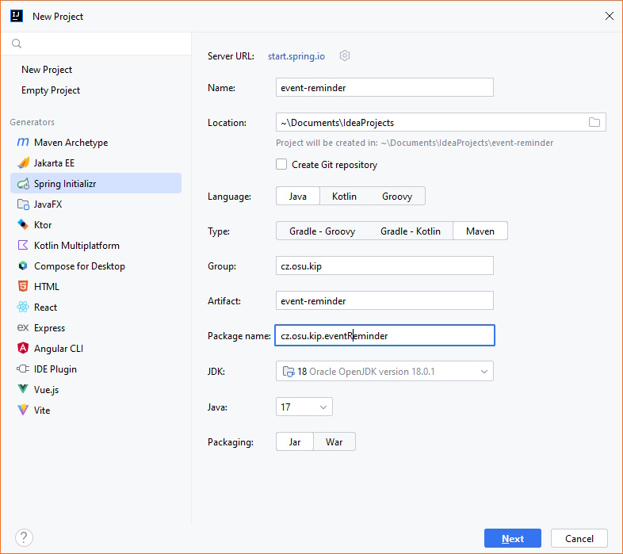
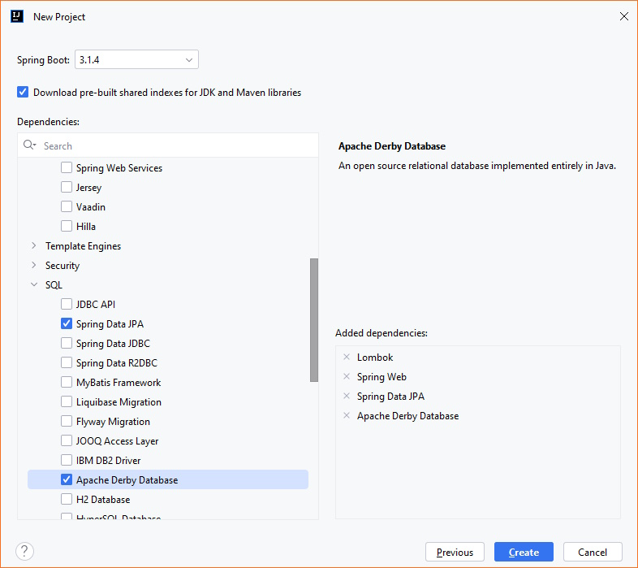

# Vytvoření projektu pro REST API

Vytvoření nového projektu se provede přes prostředí Idea a do něj integrovaný "Spring Initializr".


_Spring Initializr_ je dostupný i z jiných vývojových prostředí, nebo přímo na internetové adrese [https://start.spring.io/](https://start.spring.io/).



Pro funkcionalitu je třeba mít IntelliJ Idea ve verzi Ultimate ([https://www.jetbrains.com/idea/download/?section=windows](https://www.jetbrains.com/idea/download/?section=windows)).


Z nabídky _File_ se zvolí položka _New Project_. Z jeho nabídky se vybere položka _Spring Initializr_. Dále se vloží název projektu (bude se realizovat triviální projekt připomínek, _event-reminder_), vybere se jazyk (Java), typ projektu (Maven), JDK (>= openjdk-18) a verzi Javy (>= 17). Nakonec se zvolí balení do Jar balíčku. Volba se potvrdí tlačítkem _Next_.

<figure><figcaption></figcaption></figure>

Na další stránce průvodce se zvolí verze SpringBoot (tutorial bude demonstrován na verzi 3.1.4) a požadované závislosti. Pro tvořený projekt bude třeba:

* Developer Tools -> Lombok - knihovna pro zjednodušené vytváření třídy a další rozšíření možností jazyka java ([https://projectlombok.org/](https://projectlombok.org/)),
* Web -> Spring Web - pro tvorbu REST API,
* Security -> Spring Security (volitelně) - pro realizaci zabezpečeného přihlašování uživatelů,
* SQL -> Spring Data JPA (volitelně) - pro práci s JPA a databázovými entitami (viz [https://spring.io/projects/spring-data-jpa](https://spring.io/projects/spring-data-jpa)),
* SQL -> Apache Derby Database (volitelně) - pro připojení do databáze Apache Derby. Pokud budete chtít využívat jinou databázi, zvolte jiného poskytovatele.

V úvodní části projektu nebude realizováno přihlašování a práce s DB, později však bude příklad rozšířen.

Následně průvodce potvrdíme a vytvoří se nový projekt.

<figure><figcaption></figcaption></figure>

V novém projektu jsou pro nás aktuálně zajímavé ve složce projektu základní položky:

* /src/main/java/.../EventReminderApplication - je vstupní bod do aplikace, kde se nachází metoda `main()`.
* /src/main/resource/application.properties - je základní konfigurační soubor, který budeme využívat pro zadávání některých nastavení,
* pom.xml - soubor s Maven konfigurací; bude vysvětleno později, zjednodušeně se zde mj. definují závislosti na knihovnách, které se budou v projektu využívat.

## Dočasné potlačení zabezpečení SpringBoot


Pokud jste při vytváření projektu vložili i dependenci na Security -> Spring Security, SpringBoot automaticky v projektu nastaví základní zabezpečení. Toto zabezpečení mj. způsobí, že bez **přihlášení se nebude moci na vytvářené endpointy dostat**.\
\
Pokud jste tuto závislost do projektu nevložili, můžete/musíte tuto sekci přeskočit.


Pro vyřešení problému se zabezpečením dočasně potlačíme kontrolní mechanismy SpringBoot - bez podrobnějšího vysvětlení. Do projektu, do složky /src/mainjava/{název\_balíčku}/ vložte novou třídu `SecurityConfiguration` (měla by se objevit na stejné úrovni jako váš hlavní spouštěcí soubor `EventReminderApplication.java`. Do třídy vložte následující kód:


```java
// Some codepackage cz.osu.kip.eventReminder;

import org.springframework.context.annotation.Bean;
import org.springframework.context.annotation.Configuration;
import org.springframework.http.HttpMethod;
import org.springframework.security.config.annotation.web.builders.HttpSecurity;
import org.springframework.security.config.annotation.web.configuration.EnableWebSecurity;
import org.springframework.security.config.annotation.web.configurers.AbstractHttpConfigurer;
import org.springframework.security.config.http.SessionCreationPolicy;
import org.springframework.security.web.SecurityFilterChain;
import org.springframework.security.web.authentication.UsernamePasswordAuthenticationFilter;

@Configuration
@EnableWebSecurity
public class SecurityConfiguration {

  @Bean
  public SecurityFilterChain filterChain(HttpSecurity http) throws Exception {
    http.csrf(AbstractHttpConfigurer::disable)
            .authorizeHttpRequests(request -> request.anyRequest().permitAll());

    return http.build();
  }
}
```

