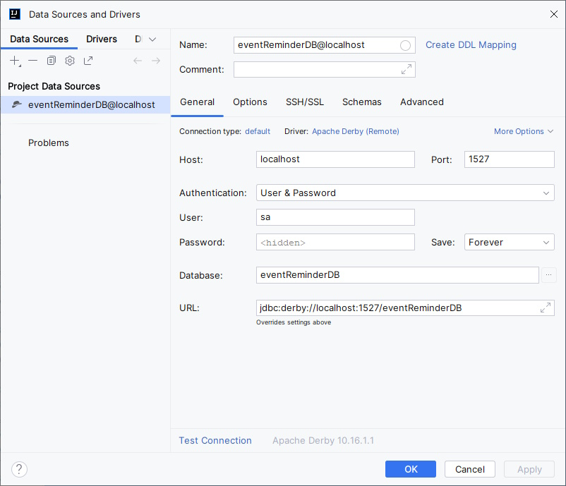

# Připojení knihoven a vytvoření DB

V úvodní části připravíme projekt na práci s DB. Vložíme do projektu požadované knihovny a spustíme a vytvoříme databázi.

## Připojení knihoven

Knihovny používané v projektu jsou definované přes Maven v souboru `pom.xml`. Do tohoto souboru do sekce `dependencies` potřebujeme připojit tři závislosti:

```xml
<dependency>
    <groupId>org.apache.derby</groupId>
    <artifactId>derby</artifactId>
    <version>10.16.1.1</version>
    <scope>runtime</scope>
</dependency>
<dependency>
    <groupId>org.apache.derby</groupId>
    <artifactId>derbytools</artifactId>
    <version>10.16.1.1</version>
    <scope>runtime</scope>
</dependency>
<!-- https://mvnrepository.com/artifact/org.apache.derby/derbyclient -->
<dependency>
    <groupId>org.apache.derby</groupId>
    <artifactId>derbyclient</artifactId>
    <version>10.16.1.1</version>
</dependency
```

Pokud jsme již při vytváření projektu přidali do dependencies podporu pro databázi Apache Derby, první dvě závislosti již v souboru `pom.xml` budou. Třetí závislost je implementace databázového ovladače, který použijeme, a nalezneme ji přes maven repository ([https://mvnrepository.com/artifact/org.apache.derby/derbyclient](https://mvnrepository.com/artifact/org.apache.derby/derbyclient)). Po vložení/úpravě souboru `pom.xml` je třeba obnovit maven závislosti v prostředí IDEA.


Je třeba dávat pozor, ať u všech tří závislostí je zadána stejná odkazovaná verze.


## Vytvoření a připojení do databáze

V prostředí IDEA můžeme vytvořit databázi přímo z jeho nástroje na prohlížení databází. U jiných SŘBD může být třeba použít vlastní přístup pro úvodní vytvoření databáze.

Před připojením/vytvářením databáze je samozřejmě nutné mít spuštěný databázový server. Apache Derby server stačí spustit s příkazové řádky, nebyl-li konfigurován jinak, připojení k němu bude realizováno jako připojení na `localhost`, port `1527`. Databázi na něm vytvoříme prvním otestováním připojení s postfixem u připojovacího řetězce `....;create=True`. Po úspěšném připojení po vytvoření databáze postfix odstraníme.

<figure><figcaption></figcaption></figure>

Následně je třeba říci JPA ve SpringBoot, kam se bude naše aplikace připojovat. Konfigurace se typicky dává do konfiguračního souboru /src/main/resource/application.properties, do kterého vložíme následující řádky:

<pre class="language-properties" data-title="application.properties" data-line-numbers><code class="lang-properties">spring.datasource.driver-class-name=org.apache.derby.jdbc.ClientDriver
spring.datasource.url=jdbc:derby://localhost:1527/eventReminderDB
spring.datasource.username=sa
spring.datasource.password=sa
<strong>spring.jpa.properties.hibernate.dialect=org.hibernate.dialect.DerbyDialect
</strong>spring.jpa.hibernate.ddl-auto=create-drop
</code></pre>

Soubor obsahuje (podle čísel řádků):

1. definici ovladače databáze, pomocí kterého bude JPA komunikovat s DB; tento je třeba typicky najít v dokumentaci k databázi; pro Apache Derby to je třída `org.apache.derby.jdbc.ClientDriver;`
2. připojení k databázi, obsahující protokol, url + port a název databáze;
3. uživatelské jméno,
4. uživatelské heslo,
5. SQL dialekt databáze - jednotlivé databázové systémy mají v SQL lehké odlišnosti a toto nastavení umožní používat SQL příkazy upravené pro specifický SŘDB,
6. Nastavení inicializace DB při spuštění (platí jen pro Hibernate jako implementaci použitou pod JPA). Možnosti jsou:

<table><thead><tr><th width="142">Hodnota</th><th>Význam</th></tr></thead><tbody><tr><td>create</td><td>Vytvoří při každém spuštění schéma databáze. Pokud existuje, je staré schéma zrušeno a nahrazeno novým (dojde k výmazu dat).</td></tr><tr><td>create-drop</td><td>Vytvoří při každém spuštění schéma databáze. Po ukončení připojení je schéma zrušeno (dojde k výmazu dat). Používá se typicky pro testování.</td></tr><tr><td>validate</td><td>Zkontroluje, zda schéma databáze pasuje na objektový entitní model; v případě chyby způsobí pád aplikace při spuštění.</td></tr><tr><td>update</td><td>Zkontroluje, zda schéma databáze pasuje na objektový entitní model; v případě rozdílu zajistí úpravu schématu (může dojít k výmazu dat)</td></tr></tbody></table>


Klíč `spring.jpa.hibernate.ddl-auto` je specifický pouze pro použití s JPA, kdy podkladovým mechanismem pro persistenci je Hibernate. JPA však může používat jiné podkladové technologie pro práci s databází. Pro ty lze použít univerzální, technologicky nezávislý klíč `spring.jpa.generate-ddl=true/false`. Bližší informace například viz [https://docs.spring.io/spring-boot/docs/1.1.0.M1/reference/html/howto-database-initialization.html](https://docs.spring.io/spring-boot/docs/1.1.0.M1/reference/html/howto-database-initialization.html).

