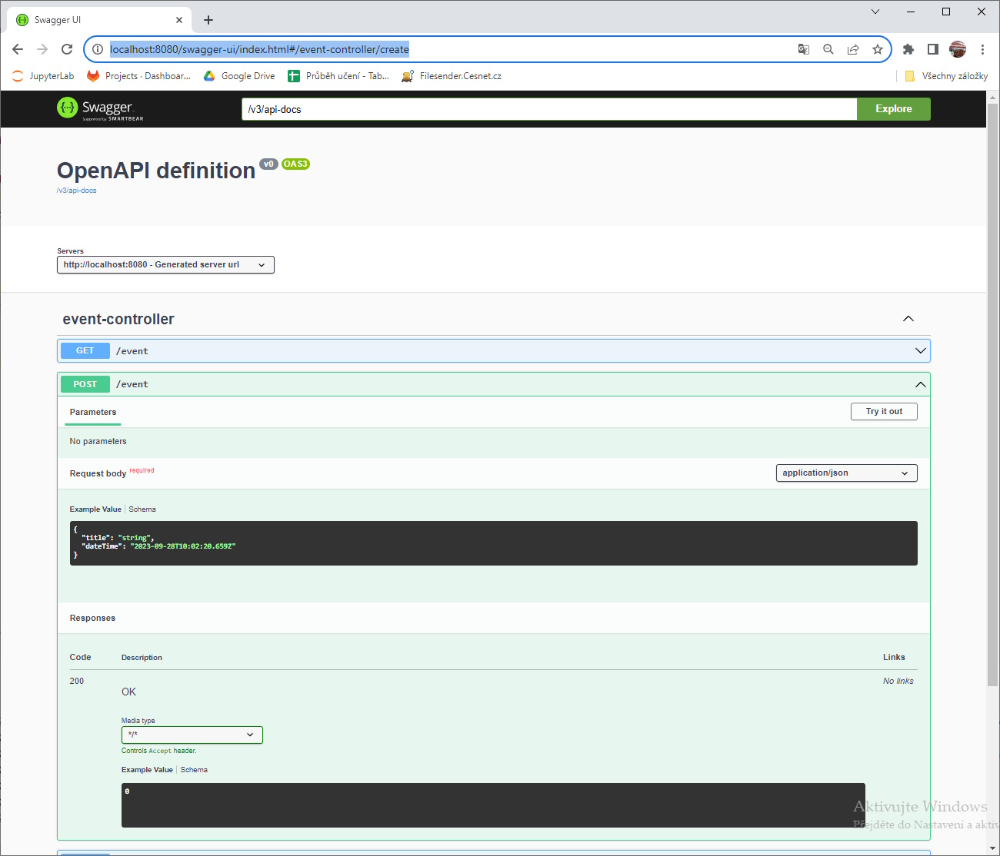
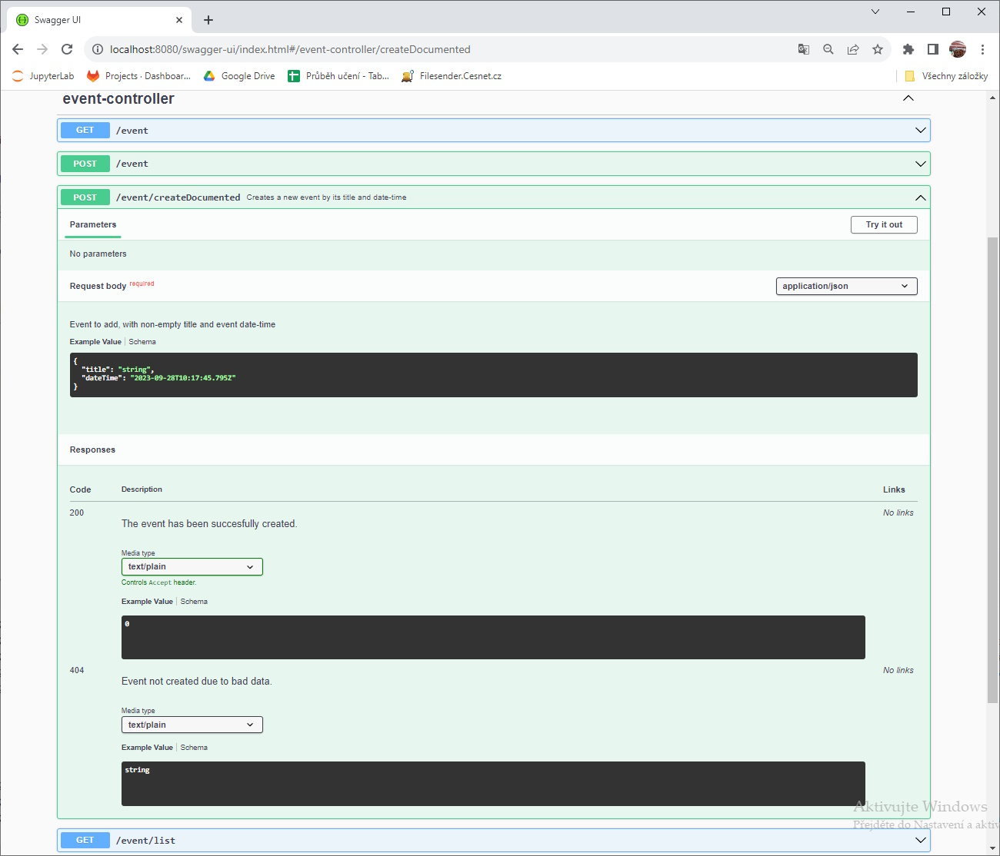

# Swagger/OpenAPI OAS - rychlý pohled na endpointy

Swagger je nástroj a rámec pro dokumentaci a testování rozhraní API (Application Programming Interface). Jedná se o otevřený standard pro popis API, který umožňuje definovat, jak API funguje, jaké má endpointy, jaké parametry očekává a jaká data vrací. Swagger také obsahuje nástroje pro generování dokumentace z komentářů ve zdrojovém kódu, vytváření testovacích klientů pro API a nástroje pro validaci datových vstupů a výstupů API.

Swagger byl později přejmenován na OpenAPI Specification (OAS) a stále se používá ve vývoji softwaru pro tvorbu a správu API. OAS je standardem pro popis RESTful API a je podporován mnoha nástroji a frameworky pro vývoj API. OAS umožňuje vytvořit jednotný a dobře zdokumentovaný popis API, což usnadňuje jeho používání a integraci s jinými systémy.

V našem projektu si ukážeme připojení OAS pro prezentaci nabízených endpointů.


Implementace připojení Swagger/OAS do SpringBoot 3.x vs 2.x se výrazně liší. Proto si vždy zkontrolujte, jakou verzi SpringBoot používáte.


## Připojení OAS do SpringBoot 3

Aktivace OAS/Swagger ve SpringBoot 3 je velmi jednoduchá. Stačí do projektu přidat požadovanou knihovnu. Do sekce `dependencies` v souboru `pom.xml` přidáme závislost na `springdoc-openapi-starter-webmvc-ui` a obnovíme Maven, aby se knihovna stáhla a přidala do projektu:

```xml
<dependency>
    <groupId>org.springdoc</groupId>
    <artifactId>springdoc-openapi-starter-webmvc-ui</artifactId>
    <version>2.1.0</version>
</dependency>
```


Pokud máte zapnuté _Spring Security_ a vytvořenou konfiguraci přístupů na endpointy vaší aplikace, zřejmě se na Swagger stránky nedostanete kvůli omezení přístupu. V tom případě je nutné v konfiguraci přístupů - tam, kde se řeší `SecurityFilterChain`, přidat výjimku pro přístup pro endpointy:\
\
.requestMatchers("/v3/").permitAll()

.requestMatchers("/swagger-ui/").permitAll()


## Vyzkoušení OAS/Swagger

Po přidání knihovny (a případné konfiguraci přístupů) stačí projekt spustit a navštívit adresu `localhost:8080/swagger-ui/index.html`. Na této stránce by se měla otevřít nabídka našich endpointů, kde lze sledovat, jaké parametry dostávají, jaké kódy a návratové objekty vracejí a také je lze provolávat pomocí tlačítka _Try it out_.

<figure><figcaption></figcaption></figure>

## Dokumentace endpointů

Jenom jako ilustrativní příklad ukážeme dokumentaci endpointu pomocí anotací, které se následně zobrazí v náhledu Swagger. Pro bližší studium odkážeme na internet. Příklad ukazuje anotaci endpointu pro vytvoření události.

#### Ukázka objektu obsahujícího data o události předávaného na endpoint

```
@Getter
@Setter
class EventDataDocumented {
  @NotBlank
  @Size(min = 1, max = 255)
  private String title;

  private LocalDateTime dateTime;
}
```

#### Ukázka okomentovaného endpointu uvnitř EventController

```java
@Operation(summary = "Creates a new event by its title and date-time")
@ApiResponses(value = {
        @ApiResponse(responseCode = "200", description = "The event has been succesfully created.",
                content = {
                        @Content(mediaType = "text/plain", schema = @Schema(implementation = Integer.class))
                }),
        @ApiResponse(responseCode = "404", description = "Event not created due to bad data.",
                content = {
                        @Content(mediaType = "text/plain", schema = @Schema(implementation = String.class))
                })
})
@PostMapping(value = "/createDocumented", produces = "text/plain", consumes = "application/json")
public int createDocumented(
        @io.swagger.v3.oas.annotations.parameters.RequestBody(
                description = "Event to add, with non-empty title and event date-time",
                required = true, content = @Content(schema = @Schema(implementation = EventDataDocumented.class)))
        EventDataDocumented data) {
  int ret = this.eventService.create(data.getTitle(), data.getDateTime());
  return ret;
}
```


Pozor, pro anotování parametru se používá anotace `@RequestBody`. Je však třeba odlišovat základní anotaci z balíčku `org.springframework.web.bind.annotation.RequestBody`, která nemá atribut `description`, a anotací z OAS v balíčku `io.swagger.v3.oas.annotations.parameters.RequestBody`.


#### Ukázka výstupu

<figure><figcaption></figcaption></figure>

Pro bližší informace například viz [https://www.baeldung.com/spring-rest-openapi-documentation](https://www.baeldung.com/spring-rest-openapi-documentation).
