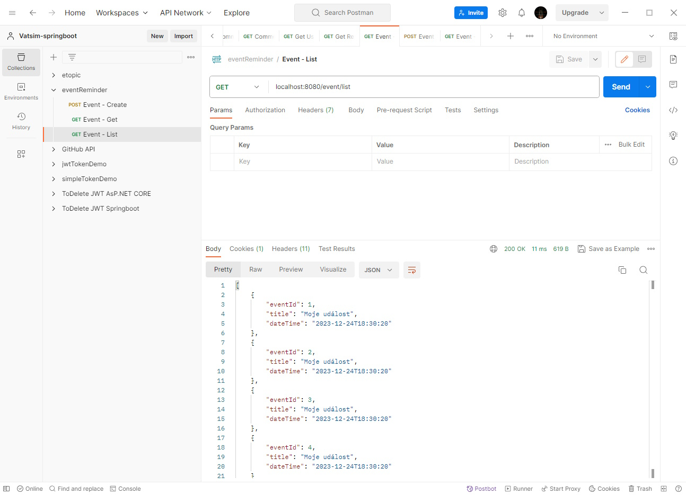

# Testování endpointů

Pro testování REST API existuje spousta rozličných nástrojů. My si ukážeme demonstraci s využitím nástroje Postman ([https://www.postman.com/](https://www.postman.com/)). Nástroj stáhneme a nainstalujeme. Dále si na webovém rozhraní vytvoříme účet a po spuštění aplikace se do ní přihlásíme.

Poté v sekci _Collections_ vytvoříme novou kolekci a budeme do ní přidávat požadavky - _Add request_.


Před testováním REST API endpointů musíme aplikaci v prostředí IDEA samozřejmě spustit. Je třeba si uvědomit, že kolekce událostí, která se vytváří, se při každém spuštění smaže - po spuštění aplikace před získáváním událostí přes REST API je tedy vhodné nejdříve nejdříve několikrát zavolat endpoint na vytvoření událostí.


## Test vložení události

Vytvoříme nový postman-request a nastavíme mu:

* název - libovolně, například "Event - Create",
* HTTP metodu - z rozbalovacího seznamu nahradíme GET za POST,
* URL adresu požadavku - SpringBoot v základu běží na portu 8080, naše testovaná adresa na lokálním počítači tedy bude `localhost:8080/event`,
* přepneme se na záložku `Body`, vybereme obsah těla jako čistý text - `raw` a případně změníme formát na `JSON` (nutné, protože Postman posílá spolu s požadavkem i informaci o formátu předávaných dat).

Do těla požadavku vložíme text přidávané položky:

```json
{
    "title": "Moje událost",
    "dateTime": "2023-12-24T18:30:20"
}
```

Vzhled výsledného požadavku:

<figure><figcaption></figcaption></figure>

Po odeslání požadavku vidíme dole v okně výsledek - zelený kód odpovědi `200 OK` a v textovém okně hodnotu přiřazeného ID. Při opakovaném volání požadavku se bude ID zvyšovat.

## Test vrácení události podle ID

Vytvoříme nový postman-request a nastavíme mu:

* název - libovolně, například "Event - Get",
* HTTP metodu ponecháme na GET,
* URL požadavek stejný jako v předchozím případě `localhost:8080/event`,
* a nyní si můžeme vybrat způsob, jak předáme hodnotu id:
  * buď v těle požadavku jako formulářové pole - v tom případě zvolíme záložku _Body_ a v ní sekci _form-data_; do sloupce _key_ zapíšeme název parametru, tedy `eventId`, do pole _value_ hodnotu 1, nebo
  * id předáme v URL parametru - v tom případě vybereme záložku _Params_ a opět do sloupce _key_ zapíšeme název parametru, tedy `eventId`, do pole _value_ hodnotu 1; všimněme si, jak se nyní URL požadavku změní na `localhost:8080/event?eventId=1`.

<figure><figcaption></figcaption></figure>

Po spuštění by se nám měl opět vrátit stav `200 OK` a buď prázdná odpověď (pokud záznam nebyl nalezen), nebo JSON s výstupem.

## Test vrácení všech událostí

Vytvoříme nový postman-request a nastavíme mu:

* název - libovolně, například "Event - List",
* HTTP metodu ponecháme na GET,
* URL požadavek nastavíme na `localhost:8080/event/list`.

Provoláním získáme informace o všech uložených záznamech v naší aplikaci.

<figure><figcaption></figcaption></figure>
